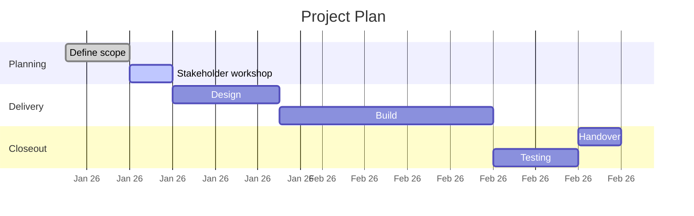

---
{"dg-publish":true,"permalink":"/publish/content/eot-assessment/","noteIcon":""}
---

John said go and check it. I went and checked it.

```mermaid
gantt
  title Project Plan
  axisFormat  %b %y 

  section Planning
  Define scope:done,    p1, 2026-01-20, 3d
  Stakeholder workshop:active,  p2, after p1,   2d

  section Delivery
  Design  :d1, after p2,   5d
  Build  :d2, after d1,   10d
  

  section Closeout
  Handover: c1, after d3,   2d
  Testing :d3, after d2,   4d

```