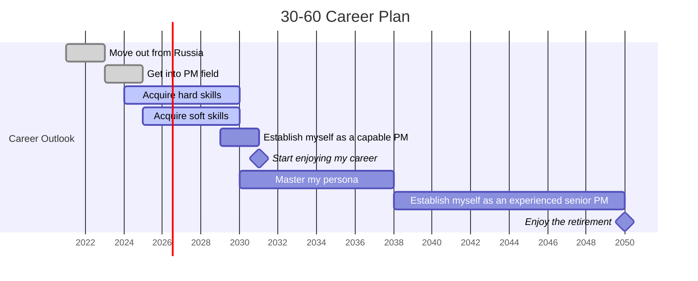

---
{"dg-publish":true,"permalink":"/publish/home-page/","tags":["gardenEntry"],"noteIcon":""}
---

## What is this place and why was it created?
#### Intro
Hello traveller,
This website is a portion of my Obsidian vault, that I published online in order to share with other people. This is only a part of a larger network of interconnected notes and files that people call PKM (personal knowledge management) or Second Brain. If you are interested in either of those terms or in particular software that was used to create and publish these notes - do not hesitate to contact me.

I am in such a point in my career where l feel I need to invest more of my time and effort to boost the progression before I become to old and slow to quickly acquire new knowledge and learn new techniques. 

When I was in my mid twenties, I came up with a master plan for the rest of my career. Not knowing exactly who am I going to be and where am I going to work, I realised one simple fact: based on the average life expectancy and realistic forecast of my vitality, it is only reasonable to say that the first 20 years of my life I was establishing as a person, as a future professional, as a working unit. The next 20 years would be a good time for me to focus on developing my career. This is the time, when I have enough energy and mental capability to quickly acquire new skills and push myself to the limit in order to get ahead of my peers. I also expected that by 40 years old, I will get tired of this constant chase and will start leaning more towards a stable job in comfortable setting and decent salary. The next 20 years after 40, my plan is to milk the results of my 20 years of career development. I am not saying I am not planning to get any better after 40, but would no longer be my main driving factor. 

Any works beyond 60 would be either a blessing or a curse and neither should be a basis for a life plan.

#### Current state of business
When I put that plan on paper and asked myself how close I am to my goal, I realised I might not be as close as I would like to be in order to feel satisfied.
<svg xmlns="http://www.w3.org/2000/svg" version="1.1" viewBox="0 0 1414.068245508533 1086.2817942396343" width=" 1000" height="1086.2817942396343" class="excalidraw-svg"><!-- svg-source:excalidraw --><metadata/><defs></defs><rect x="0" y="0" width="1414.068245508533" height="1086.2817942396343" fill="#fffce8"/><g stroke-linecap="round"><g transform="translate(102.58350687908865 13.589405305602668) rotate(0 85.5503725853971 0.08166211433712078)"><path d="M-0.76 0.87 C27.78 0.79, 143.09 -0.66, 171.86 -0.7 M1.05 0.27 C29.36 0.36, 142.53 0.75, 170.86 0.47" stroke="#1e1e1e" stroke-width="2" fill="none"/></g></g><mask/><g stroke-linecap="round"><g transform="translate(103.28382018382547 112.59792611533135) rotate(0 85.7568037035166 -0.2553356004025886)"><path d="M-0.15 0.58 C28.4 0.51, 142.43 0.83, 170.99 0.61 M-1.68 -0.17 C27.25 -0.07, 143.96 -1.25, 173.2 -1.2" stroke="#1e1e1e" stroke-width="2" fill="none"/></g></g><mask/><g stroke-linecap="round"><g transform="translate(102.92427185313556 14.142515090582947) rotate(0 16.031723981036862 22.764233152694715)"><path d="M-1.09 0.49 C4.34 8.1, 27.66 38.46, 33.15 45.82 M0.55 -0.3 C5.85 6.92, 27.68 36.18, 32.75 43.81" stroke="#1e1e1e" stroke-width="2" fill="none"/></g></g><mask/><g stroke-linecap="round"><g transform="translate(102.92427185313556 113.69185132162818) rotate(0 16.191599353886772 -26.126895886309228)"><path d="M1.04 0.2 C6.6 -8.62, 27.17 -43.83, 32.26 -52.45 M0.13 -0.74 C5.6 -9.49, 25.54 -43.17, 31.18 -51.42" stroke="#1e1e1e" stroke-width="2" fill="none"/></g></g><mask/><g stroke-linecap="round"><g transform="translate(275.76497517166933 13.931538243619912) rotate(0 16.225891230239597 22.47074153286934)"><path d="M0.47 0.1 C5.47 7.83, 25.69 38.24, 31.05 45.84 M-0.75 -0.9 C4.53 6.5, 27.72 35.84, 33.2 43.83" stroke="#1e1e1e" stroke-width="2" fill="none"/></g></g><mask/><g stroke-linecap="round"><g transform="translate(275.76497517166933 113.48087447466514) rotate(0 15.976511202044435 -25.60707119072208)"><path d="M-1.06 0.21 C4.36 -8.37, 27.55 -42.88, 33.02 -51.43 M0.58 -0.72 C5.85 -9.11, 26.73 -41.11, 32.34 -49.86" stroke="#1e1e1e" stroke-width="2" fill="none"/></g></g><mask/><g stroke-linecap="round"><g transform="translate(282.32988042441445 12.99108414673833) rotate(0 86.463411032468 -0.5069703429319361)"><path d="M0.65 -0.32 C29 -0.4, 142.7 0.49, 171.12 0.55 M-0.47 -1.53 C28.17 -1.45, 144.38 -1.77, 173.39 -1.29" stroke="#1e1e1e" stroke-width="2" fill="none"/></g></g><mask/><g stroke-linecap="round"><g transform="translate(283.0301937291513 111.9996049564669) rotate(0 86.30400215407263 0.6661360474827802)"><path d="M-0.83 0.55 C27.59 0.6, 142.46 -0.09, 171.15 0 M0.93 -0.21 C29.68 0.07, 145.24 1.61, 173.44 1.54" stroke="#1e1e1e" stroke-width="2" fill="none"/></g></g><mask/><g stroke-linecap="round"><g transform="translate(282.6706453984614 13.54419393171861) rotate(0 16.49162863715833 22.858043988911163)"><path d="M-0.8 0 C4.57 7.71, 25.87 39.02, 31.43 46.76 M0.98 -1.04 C6.82 6.31, 28.61 37.64, 33.78 45.23" stroke="#1e1e1e" stroke-width="2" fill="none"/></g></g><mask/><g stroke-linecap="round"><g transform="translate(282.6706453984614 113.09353016276373) rotate(0 16.13242293152922 -25.650387935893377)"><path d="M-0.68 1.13 C4.94 -7.32, 27.6 -41.85, 32.94 -50.72 M1.16 0.68 C6.74 -8.11, 26.8 -43.8, 32.22 -52.43" stroke="#1e1e1e" stroke-width="2" fill="none"/></g></g><mask/><g stroke-linecap="round"><g transform="translate(455.51134871699514 13.333217084755574) rotate(0 16.169629131856453 23.18761769886663)"><path d="M0.44 0.77 C5.72 8.09, 25.72 37.52, 31 45.02 M-0.8 0.13 C4.9 8.11, 27.77 38.4, 33.13 46.24" stroke="#1e1e1e" stroke-width="2" fill="none"/></g></g><mask/><g stroke-linecap="round"><g transform="translate(455.51134871699514 112.8825533158008) rotate(0 15.720051749087474 -24.812308576362)"><path d="M-1.11 -0.6 C4.25 -9.28, 27.05 -42.77, 32.55 -51.32 M0.51 1.7 C5.67 -6.84, 26.58 -40.95, 31.62 -49.69" stroke="#1e1e1e" stroke-width="2" fill="none"/></g></g><mask/><g stroke-linecap="round"><g transform="translate(461.5108402442946 12.26420870652123) rotate(0 85.55285787199057 0.0036554512651605364)"><path d="M-0.12 -1.16 C28.82 -1.2, 144.2 -0.65, 172.74 -0.33 M-1.64 0.85 C27.29 0.99, 143 1.37, 172.21 1.03" stroke="#1e1e1e" stroke-width="2" fill="none"/></g></g><mask/><g stroke-linecap="round"><g transform="translate(462.21115354903134 111.27272951625002) rotate(0 86.59602706257613 -0.3839408314671573)"><path d="M0.79 -0.33 C29.34 -0.01, 142.48 0.83, 171.15 0.78 M-0.25 -1.55 C28.69 -1.46, 144.65 -1.26, 173.44 -0.93" stroke="#1e1e1e" stroke-width="2" fill="none"/></g></g><mask/><g stroke-linecap="round"><g transform="translate(461.85160521834166 12.817318491501283) rotate(0 16.086161308421794 23.19570108217721)"><path d="M-0.8 0.78 C4.56 8.34, 27.32 37.5, 32.97 45.02 M0.98 0.15 C6.19 7.89, 27.16 38.37, 32.48 46.25" stroke="#1e1e1e" stroke-width="2" fill="none"/></g></g><mask/><g stroke-linecap="round"><g transform="translate(461.85160521834166 112.36665472254685) rotate(0 16.681270316876066 -25.719711707182)"><path d="M0.86 -0.6 C6.58 -9.26, 28.21 -42.6, 33.51 -51.18 M-0.14 1.7 C5.57 -7.41, 27.73 -44.34, 33.08 -53.14" stroke="#1e1e1e" stroke-width="2" fill="none"/></g></g><mask/><g stroke-linecap="round"><g transform="translate(634.6923085368753 12.606341644538361) rotate(0 16.150981238021558 22.836119601554913)"><path d="M1 0.31 C6.23 7.91, 27.13 37.54, 32.24 45.02 M0.06 -0.57 C5.07 7.24, 26.26 38.43, 31.36 46.24" stroke="#1e1e1e" stroke-width="2" fill="none"/></g></g><mask/><g stroke-linecap="round"><g transform="translate(634.6923085368753 112.1556778755837) rotate(0 15.41553335342519 -25.09880188921818)"><path d="M0.13 -0.6 C5.31 -9.3, 26.61 -43.28, 32.09 -51.9 M-1.26 1.7 C3.64 -6.86, 25.29 -41.72, 30.92 -50.57" stroke="#1e1e1e" stroke-width="2" fill="none"/></g></g><mask/><g stroke-linecap="round"><g transform="translate(641.2572137896203 11.665887547656894) rotate(0 86.01028667364632 -0.6772999595850706)"><path d="M-0.42 -0.41 C28.3 -0.44, 143.83 -0.98, 172.44 -0.8 M1.56 -1.67 C30.15 -1.51, 143.65 0.27, 171.75 0.31" stroke="#1e1e1e" stroke-width="2" fill="none"/></g></g><mask/><g stroke-linecap="round"><g transform="translate(641.9575270943571 110.67440835738557) rotate(0 86.46135739807404 0.10955484129488013)"><path d="M0.49 -0.8 C29.11 -0.63, 142.88 0.3, 171.27 0.63 M-0.71 1.39 C28.34 1.24, 144.65 -0.84, 173.63 -1.17" stroke="#1e1e1e" stroke-width="2" fill="none"/></g></g><mask/><g stroke-linecap="round"><g transform="translate(641.5979787636674 12.218997332637173) rotate(0 16.23638583971473 23.34118173522478)"><path d="M-0.67 0.63 C4.41 8.55, 25.7 39.4, 31.01 46.77 M1.17 -0.09 C6.57 7.6, 27.74 37.61, 33.15 45.26" stroke="#1e1e1e" stroke-width="2" fill="none"/></g></g><mask/><g stroke-linecap="round"><g transform="translate(641.5979787636674 111.76833356368252) rotate(0 16.357933819032837 -25.553051787264394)"><path d="M-1.1 1.15 C4.28 -7.66, 25.89 -43.43, 31.59 -52.26 M0.53 0.71 C6.33 -8.02, 28.46 -42.55, 33.81 -51.12" stroke="#1e1e1e" stroke-width="2" fill="none"/></g></g><mask/><g stroke-linecap="round"><g transform="translate(814.438682082201 12.008020485674024) rotate(0 15.889334087505048 22.933749605543653)"><path d="M-0.92 -0.77 C4.71 6.59, 27.11 37.44, 32.7 45.28 M0.79 1.44 C6.42 9.48, 26.83 39.49, 32.06 46.64" stroke="#1e1e1e" stroke-width="2" fill="none"/></g></g><mask/><g stroke-linecap="round"><g transform="translate(814.438682082201 110.9161774074148) rotate(0 16.25078359130734 -26.466387246347722)"><path d="M0.59 -0.34 C6.26 -8.69, 27.56 -42.15, 33.06 -50.82 M-0.56 -1.57 C5.08 -10.19, 26.74 -44.27, 32.4 -52.59" stroke="#1e1e1e" stroke-width="2" fill="none"/></g></g><mask/><g transform="translate(140.10442548994683 37.36671002425771) rotate(0 67.21825408935547 22.14950587610275)"><text x="67.21825408935547" y="15.610971741477208" font-family="Excalifont, Xiaolai, sans-serif, Segoe UI Emoji" font-size="17.71960470088219px" fill="#1e1e1e" text-anchor="middle" style="white-space: pre;" direction="ltr" dominant-baseline="alphabetic">Kindy &amp; Primary</text><text x="67.21825408935547" y="37.760477617579944" font-family="Excalifont, Xiaolai, sans-serif, Segoe UI Emoji" font-size="17.71960470088219px" fill="#1e1e1e" text-anchor="middle" style="white-space: pre;" direction="ltr" dominant-baseline="alphabetic">0-10</text></g><g transform="translate(364.9754238378014 35.20762525938062) rotate(0 26.910324096679688 22.14950587610275)"><text x="26.910324096679688" y="15.610971741477208" font-family="Excalifont, Xiaolai, sans-serif, Segoe UI Emoji" font-size="17.71960470088219px" fill="#1e1e1e" text-anchor="middle" style="white-space: pre;" direction="ltr" dominant-baseline="alphabetic">Liceum</text><text x="26.910324096679688" y="37.760477617579944" font-family="Excalifont, Xiaolai, sans-serif, Segoe UI Emoji" font-size="17.71960470088219px" fill="#1e1e1e" text-anchor="middle" style="white-space: pre;" direction="ltr" dominant-baseline="alphabetic">10-20</text></g><g transform="translate(513.5932836009551 33.92526664077127) rotate(0 46.92262268066406 22.14950587610275)"><text x="46.92262268066406" y="15.610971741477206" font-family="Excalifont, Xiaolai, sans-serif, Segoe UI Emoji" font-size="17.719604700882186px" fill="#1e1e1e" text-anchor="middle" style="white-space: pre;" direction="ltr" dominant-baseline="alphabetic">Army &amp; Uni</text><text x="46.92262268066406" y="37.76047761757994" font-family="Excalifont, Xiaolai, sans-serif, Segoe UI Emoji" font-size="17.719604700882186px" fill="#1e1e1e" text-anchor="middle" style="white-space: pre;" direction="ltr" dominant-baseline="alphabetic">20-25</text></g><g transform="translate(695.9928999363904 34.56644595007617) rotate(0 47.25910949707031 22.14950587610275)"><text x="47.25910949707031" y="15.610971741477206" font-family="Excalifont, Xiaolai, sans-serif, Segoe UI Emoji" font-size="17.719604700882186px" fill="#1e1e1e" text-anchor="middle" style="white-space: pre;" direction="ltr" dominant-baseline="alphabetic">Work in RU</text><text x="47.25910949707031" y="37.76047761757994" font-family="Excalifont, Xiaolai, sans-serif, Segoe UI Emoji" font-size="17.719604700882186px" fill="#1e1e1e" text-anchor="middle" style="white-space: pre;" direction="ltr" dominant-baseline="alphabetic">25-30</text></g><g stroke-linecap="round"><g transform="translate(821.0586295634016 110.77351804751254) rotate(0 86.00975038964664 -0.38641019948374833)"><path d="M-0.98 -0.23 C27.68 -0.23, 142.21 0.87, 170.86 0.75 M0.71 -1.4 C29.82 -1.81, 144.24 -1.19, 173 -0.98" stroke="#1e1e1e" stroke-width="2" fill="none"/></g></g><mask/><g stroke-linecap="round"><g transform="translate(820.6990812327116 12.318107022763797) rotate(0 16.06696828080625 22.930361479349187)"><path d="M-1.09 0.75 C4.25 8.24, 25.45 37.32, 31.06 44.7 M0.54 0.1 C6.32 7.73, 27.97 38.1, 33.22 45.76" stroke="#1e1e1e" stroke-width="2" fill="none"/></g></g><mask/><g stroke-linecap="round"><g transform="translate(820.6990812327116 111.86744325380926) rotate(0 15.959414158053335 -25.432639130748555)"><path d="M-1.05 -0.92 C4.63 -9.72, 27.39 -43.52, 32.97 -52.08 M0.6 1.21 C6.26 -7.51, 27.09 -42.09, 32.26 -50.85" stroke="#1e1e1e" stroke-width="2" fill="none"/></g></g><mask/><g stroke-linecap="round"><g transform="translate(993.5397845512456 12.107130175800876) rotate(0 15.633130130603027 22.697717011101304)"><path d="M0.46 -0.59 C5.97 7.04, 26.94 37.15, 32.03 44.85 M-0.76 1.72 C4.68 9.56, 25.36 38.45, 31.04 45.98" stroke="#1e1e1e" stroke-width="2" fill="none"/></g></g><mask/><g stroke-linecap="round"><g transform="translate(993.5397845512456 111.656466406846) rotate(0 15.974558751470973 -25.036786367393802)"><path d="M-0.08 -0.77 C5.08 -9.26, 25.86 -43.09, 31.4 -51.51 M-1.58 1.44 C3.89 -6.8, 27.81 -41.44, 33.53 -49.98" stroke="#1e1e1e" stroke-width="2" fill="none"/></g></g><mask/><g stroke-linecap="round"><g transform="translate(999.4635104946859 13.090214006833435) rotate(0 85.74209044848 -0.8118053081117296)"><path d="M-1.11 -0.02 C27.67 0.14, 143.61 0.29, 172.59 0.21 M0.51 -1.08 C29.2 -1.23, 143.33 -2.08, 171.98 -1.8" stroke="#1e1e1e" stroke-width="2" fill="none"/></g></g><mask/><g stroke-linecap="round"><g transform="translate(1000.1638237994229 112.09873481656223) rotate(0 86.14617947865639 0.03788274563851246)"><path d="M0.64 0.21 C29.62 0.13, 144.07 -0.26, 172.77 -0.48 M-0.48 -0.72 C28.51 -0.64, 143.41 0.75, 172.25 0.8" stroke="#1e1e1e" stroke-width="2" fill="none"/></g></g><mask/><g stroke-linecap="round"><g transform="translate(999.804275468733 13.643323791813714) rotate(0 16.40949037118168 21.81866720838076)"><path d="M0.82 -0.48 C6.22 6.89, 27.99 36.84, 33.03 44.48 M-0.21 -1.78 C5.06 5.68, 26.96 37.37, 32.56 45.42" stroke="#1e1e1e" stroke-width="2" fill="none"/></g></g><mask/><g stroke-linecap="round"><g transform="translate(999.804275468733 113.19266002285883) rotate(0 16.7567277895283 -25.447386539079048)"><path d="M0.92 -1.14 C6.02 -9.69, 26.1 -43.32, 31.43 -51.77 M-0.06 0.87 C5.32 -7.45, 28.17 -41.78, 33.58 -50.38" stroke="#1e1e1e" stroke-width="2" fill="none"/></g></g><mask/><g stroke-linecap="round"><g transform="translate(1172.6449787872666 13.432346944850451) rotate(0 15.713780074252796 22.563505359716487)"><path d="M-1.08 -0.28 C4.19 7.45, 27.05 37.45, 32.51 45.26 M0.56 -1.47 C5.62 6.53, 26.75 38.91, 31.77 46.6" stroke="#1e1e1e" stroke-width="2" fill="none"/></g></g><mask/><g stroke-linecap="round"><g transform="translate(1172.6449787872666 112.98168317589602) rotate(0 15.595269815660643 -26.29140174428352)"><path d="M0.4 -0.37 C5.92 -8.75, 26.72 -41.89, 32.04 -50.57 M-0.85 -1.61 C4.56 -10.29, 25.47 -43.87, 30.85 -52.21" stroke="#1e1e1e" stroke-width="2" fill="none"/></g></g><mask/><g transform="translate(854.5359744590752 33.426055172033784) rotate(0 64.82740783691406 22.14950587610275)"><text x="64.82740783691406" y="15.610971741477206" font-family="Excalifont, Xiaolai, sans-serif, Segoe UI Emoji" font-size="17.719604700882186px" fill="#1e1e1e" text-anchor="middle" style="white-space: pre;" direction="ltr" dominant-baseline="alphabetic">Waikeria Prison</text><text x="64.82740783691406" y="37.76047761757994" font-family="Excalifont, Xiaolai, sans-serif, Segoe UI Emoji" font-size="17.719604700882186px" fill="#1e1e1e" text-anchor="middle" style="white-space: pre;" direction="ltr" dominant-baseline="alphabetic">(30-33)</text></g><g transform="translate(1068.730248277198 35.990772409252486) rotate(0 32.72805786132812 22.14950587610275)"><text x="32.728057861328125" y="15.610971741477206" font-family="Excalifont, Xiaolai, sans-serif, Segoe UI Emoji" font-size="17.719604700882186px" fill="#1e1e1e" text-anchor="middle" style="white-space: pre;" direction="ltr" dominant-baseline="alphabetic">Octa</text><text x="32.728057861328125" y="37.76047761757994" font-family="Excalifont, Xiaolai, sans-serif, Segoe UI Emoji" font-size="17.719604700882186px" fill="#1e1e1e" text-anchor="middle" style="white-space: pre;" direction="ltr" dominant-baseline="alphabetic">(33-35)</text></g><g stroke-linecap="round"><g transform="translate(820.7616017842926 12.148909578441135) rotate(0 85.84622799802935 -0.6879136271386983)"><path d="M-0.61 -0.06 C28.17 -0.08, 143.55 0.14, 172.31 0.3 M1.27 -1.14 C29.95 -1.58, 143.24 -1.69, 171.54 -1.67" stroke="#1e1e1e" stroke-width="2" fill="none"/></g></g><mask/><g stroke-linecap="round"><g transform="translate(101.36686837372031 118.89355514888348) rotate(0 0.31198619417841655 343.1074221982278)"><path d="M-0.34 -0.53 C-0.12 113.94, 0.94 572.24, 0.96 686.75" stroke="#1e1e1e" stroke-width="2.5" fill="none" stroke-dasharray="8 10"/></g></g><mask/><g stroke-linecap="round"><g transform="translate(310.245989405301 59.95835980629522) rotate(0 0.2650047853038018 370.59636763419985)"><path d="M0.73 -0.59 C0.89 123.16, -0.21 618.02, -0.22 741.78" stroke="#1e1e1e" stroke-width="2.5" fill="none" stroke-dasharray="1.5 8"/></g></g><mask/><g stroke-linecap="round"><g transform="translate(487.6043482393994 59.02277591928714) rotate(0 0 371.22309959206757)"><path d="M0 0 C0 123.74, 0 618.71, 0 742.45" stroke="#1e1e1e" stroke-width="2.5" fill="none" stroke-dasharray="1.5 8"/></g></g><mask/><g stroke-linecap="round"><g transform="translate(665.5204003609416 58.045215193344575) rotate(0 0 371.22309959206757)"><path d="M0 0 C0 123.74, 0 618.71, 0 742.45" stroke="#1e1e1e" stroke-width="2.5" fill="none" stroke-dasharray="1.5 8"/></g></g><mask/><g stroke-linecap="round"><g transform="translate(845.3915739343689 59.02277591928714) rotate(0 0 371.22309959206757)"><path d="M0 0 C0 123.74, 0 618.71, 0 742.45" stroke="#1e1e1e" stroke-width="2.5" fill="none" stroke-dasharray="1.5 8"/></g></g><mask/><g stroke-linecap="round"><g transform="translate(1026.2403082337391 58.045215193344575) rotate(0 0 371.22309959206757)"><path d="M0 0 C0 123.74, 0 618.71, 0 742.45" stroke="#1e1e1e" stroke-width="2.5" fill="none" stroke-dasharray="1.5 8"/></g></g><mask/><g stroke-linecap="round"><g transform="translate(1206.1114818071662 57.067654467402235) rotate(0 0 371.22309959206757)"><path d="M0 0 C0 123.74, 0 618.71, 0 742.45" stroke="#1e1e1e" stroke-width="2.5" fill="none" stroke-dasharray="1.5 8"/></g></g><mask/><g stroke-linecap="round"><g transform="translate(80.08497378173149 803.382119716373) rotate(0 661.4299999085364 0.32646518268013835)"><path d="M0.22 -0.77 C221.01 -0.9, 1103.41 -0.32, 1323.98 -0.15 M-1.12 1.44 C219.54 1.44, 1101.6 1.26, 1322.82 1.32" stroke="#1e1e1e" stroke-width="2" fill="none"/></g><g transform="translate(80.08497378173149 803.382119716373) rotate(0 661.4299999085364 0.32646518268013835)"><path d="M1299.33 9.87 C1303.56 7.12, 1310.15 4.59, 1322.82 1.32 M1299.33 9.87 C1306.1 7.37, 1314.58 3.49, 1322.82 1.32" stroke="#1e1e1e" stroke-width="2" fill="none"/></g><g transform="translate(80.08497378173149 803.382119716373) rotate(0 661.4299999085364 0.32646518268013835)"><path d="M1299.33 -7.24 C1303.65 -5.94, 1310.24 -4.42, 1322.82 1.32 M1299.33 -7.24 C1306.13 -4.17, 1314.61 -2.48, 1322.82 1.32" stroke="#1e1e1e" stroke-width="2" fill="none"/></g></g><mask/><g stroke-linecap="round"><g transform="translate(78.12985232984647 802.4045589904302) rotate(0 -0.6670334672372178 -220.31863338438902)"><path d="M0.04 1.1 C0.16 -72.63, -0.17 -368.21, -0.22 -441.73 M-1.4 0.63 C-1.38 -73.03, -1.32 -366.88, -1.28 -440.65" stroke="#1e1e1e" stroke-width="2" fill="none"/></g><g transform="translate(78.12985232984647 802.4045589904302) rotate(0 -0.6670334672372178 -220.31863338438902)"><path d="M7.26 -417.15 C7.05 -422.77, 1.89 -428.07, -1.28 -440.65 M7.26 -417.15 C4.02 -424.93, 0.45 -434.93, -1.28 -440.65" stroke="#1e1e1e" stroke-width="2" fill="none"/></g><g transform="translate(78.12985232984647 802.4045589904302) rotate(0 -0.6670334672372178 -220.31863338438902)"><path d="M-9.84 -417.16 C-6.22 -422.78, -7.56 -428.08, -1.28 -440.65 M-9.84 -417.16 C-6.76 -424.96, -4.02 -434.95, -1.28 -440.65" stroke="#1e1e1e" stroke-width="2" fill="none"/></g></g><mask/><g stroke-linecap="round" transform="translate(-72.77363476220467 552.4368304712134) rotate(270 106.06533876476567 23.291704002561005)"><path d="M11.65 0 C70.46 2.36, 125.26 2.16, 200.48 0 M11.65 0 C66.8 0.65, 120.18 0.29, 200.48 0 M200.48 0 C208.93 -1.27, 211.18 2.25, 212.13 11.65 M200.48 0 C208.88 2.2, 211.39 2.51, 212.13 11.65 M212.13 11.65 C213.26 20.47, 213.81 29.69, 212.13 34.94 M212.13 11.65 C212.25 20.12, 212.12 28.64, 212.13 34.94 M212.13 34.94 C213.67 43.78, 207.12 46.19, 200.48 46.58 M212.13 34.94 C210.07 44.7, 207.7 44.83, 200.48 46.58 M200.48 46.58 C131.75 45.26, 65.06 43.28, 11.65 46.58 M200.48 46.58 C158.72 46.94, 117.52 47.28, 11.65 46.58 M11.65 46.58 C4.11 48.25, -1.47 41.08, 0 34.94 M11.65 46.58 C1.64 48.71, 1.73 41.19, 0 34.94 M0 34.94 C1.41 28.91, 0.78 24.74, 0 11.65 M0 34.94 C-0.53 29.3, 0.22 21.41, 0 11.65 M0 11.65 C0.54 2.05, 3.06 1.62, 11.65 0 M0 11.65 C-1.23 2.83, 4.05 1, 11.65 0" stroke="#1e1e1e" stroke-width="2" fill="none"/></g><g transform="translate(-59.33154123669692 564.6537815357232) rotate(270 92.62324523925781 11.074752938051375)"><text x="92.62324523925781" y="15.610971741477206" font-family="Excalifont, Xiaolai, sans-serif, Segoe UI Emoji" font-size="17.719604700882186px" fill="#1e1e1e" text-anchor="middle" style="white-space: pre;" direction="ltr" dominant-baseline="alphabetic">Perceived competency</text></g><g stroke-linecap="round" transform="translate(103.4422182067982 152.55567428409313) rotate(0 102.65541961459752 69.24865901749666)"><path d="M32 0 C80.24 1.27, 130.84 1.15, 173.31 0 M32 0 C76.27 0.28, 121.92 -0.43, 173.31 0 M173.31 0 C195.14 -1.13, 205.91 9.72, 205.31 32 M173.31 0 C192.43 2.03, 207.31 9.05, 205.31 32 M205.31 32 C205.47 51.81, 203.56 71.03, 205.31 106.5 M205.31 32 C205.11 53.21, 205.27 73.77, 205.31 106.5 M205.31 106.5 C206.9 126.72, 194.24 137.55, 173.31 138.5 M205.31 106.5 C205.95 129.74, 194.89 139.37, 173.31 138.5 M173.31 138.5 C131.4 137.55, 86.11 137.99, 32 138.5 M173.31 138.5 C118.47 139.69, 65.28 138.63, 32 138.5 M32 138.5 C10.44 140.3, 1.42 127.66, 0 106.5 M32 138.5 C11.05 139.98, 0.13 128.66, 0 106.5 M0 106.5 C-0.76 88.38, 0.76 67.86, 0 32 M0 106.5 C-1.22 82.37, -0.75 60.31, 0 32 M0 32 C0.59 9.65, 11.78 -0.14, 32 0 M0 32 C-2 9.42, 8.83 -0.89, 32 0" stroke="#1e1e1e" stroke-width="2" fill="none"/></g><g transform="translate(111.57696216221598 166.4305686113329) rotate(0 94.52067565917969 55.37376469025685)"><text x="94.52067565917969" y="11.15069410105515" font-family="Excalifont, Xiaolai, sans-serif, Segoe UI Emoji" font-size="12.656860500630136px" fill="#1e1e1e" text-anchor="middle" style="white-space: pre;" direction="ltr" dominant-baseline="alphabetic">Establishment </text><text x="94.52067565917969" y="26.971769726842822" font-family="Excalifont, Xiaolai, sans-serif, Segoe UI Emoji" font-size="12.656860500630136px" fill="#1e1e1e" text-anchor="middle" style="white-space: pre;" direction="ltr" dominant-baseline="alphabetic">of my personality. Developing</text><text x="94.52067565917969" y="42.79284535263049" font-family="Excalifont, Xiaolai, sans-serif, Segoe UI Emoji" font-size="12.656860500630136px" fill="#1e1e1e" text-anchor="middle" style="white-space: pre;" direction="ltr" dominant-baseline="alphabetic">the basis of charisma and</text><text x="94.52067565917969" y="58.613920978418165" font-family="Excalifont, Xiaolai, sans-serif, Segoe UI Emoji" font-size="12.656860500630136px" fill="#1e1e1e" text-anchor="middle" style="white-space: pre;" direction="ltr" dominant-baseline="alphabetic">interpersonal skills. Growing as</text><text x="94.52067565917969" y="74.43499660420584" font-family="Excalifont, Xiaolai, sans-serif, Segoe UI Emoji" font-size="12.656860500630136px" fill="#1e1e1e" text-anchor="middle" style="white-space: pre;" direction="ltr" dominant-baseline="alphabetic">a happy and communicable kid,</text><text x="94.52067565917969" y="90.2560722299935" font-family="Excalifont, Xiaolai, sans-serif, Segoe UI Emoji" font-size="12.656860500630136px" fill="#1e1e1e" text-anchor="middle" style="white-space: pre;" direction="ltr" dominant-baseline="alphabetic">which is a key element for any</text><text x="94.52067565917969" y="106.07714785578118" font-family="Excalifont, Xiaolai, sans-serif, Segoe UI Emoji" font-size="12.656860500630136px" fill="#1e1e1e" text-anchor="middle" style="white-space: pre;" direction="ltr" dominant-baseline="alphabetic">people-oriented career path.</text></g><g stroke-linecap="round" transform="translate(307.33143976806446 154.36786410313084) rotate(0 90.02712711788217 69.24865901749666)"><path d="M32 0 C56.68 0.33, 78.35 -0.58, 148.05 0 M32 0 C72.3 -0.18, 114.96 -1.02, 148.05 0 M148.05 0 C169.29 -0.58, 181.99 11.41, 180.05 32 M148.05 0 C167.94 -0.65, 181.69 10.92, 180.05 32 M180.05 32 C179.03 49.91, 179.05 70.36, 180.05 106.5 M180.05 32 C180.33 58.32, 181.24 84.44, 180.05 106.5 M180.05 106.5 C179.57 126.12, 169.67 137.84, 148.05 138.5 M180.05 106.5 C181.4 126.76, 169.34 139.48, 148.05 138.5 M148.05 138.5 C117.03 141.36, 86.3 138.94, 32 138.5 M148.05 138.5 C103.75 139.93, 60.47 140.15, 32 138.5 M32 138.5 C9.52 140.29, -0.32 129.09, 0 106.5 M32 138.5 C10.62 139.07, 1.21 127.42, 0 106.5 M0 106.5 C1.97 90.34, 2.15 76.57, 0 32 M0 106.5 C-1.04 85.36, -0.75 63.77, 0 32 M0 32 C-0.37 11.91, 11.76 -0.86, 32 0 M0 32 C-0.44 8.85, 9.63 0.02, 32 0" stroke="#1e1e1e" stroke-width="2" fill="none"/></g><g transform="translate(312.82505095577085 160.33222061747676) rotate(0 84.53351593017578 63.284302503150684)"><text x="84.53351593017578" y="11.15069410105515" font-family="Excalifont, Xiaolai, sans-serif, Segoe UI Emoji" font-size="12.656860500630136px" fill="#1e1e1e" text-anchor="middle" style="white-space: pre;" direction="ltr" dominant-baseline="alphabetic">Acquiring numeracy,</text><text x="84.53351593017578" y="26.971769726842822" font-family="Excalifont, Xiaolai, sans-serif, Segoe UI Emoji" font-size="12.656860500630136px" fill="#1e1e1e" text-anchor="middle" style="white-space: pre;" direction="ltr" dominant-baseline="alphabetic">developing sound judgement</text><text x="84.53351593017578" y="42.79284535263049" font-family="Excalifont, Xiaolai, sans-serif, Segoe UI Emoji" font-size="12.656860500630136px" fill="#1e1e1e" text-anchor="middle" style="white-space: pre;" direction="ltr" dominant-baseline="alphabetic">of this world. At later</text><text x="84.53351593017578" y="58.613920978418165" font-family="Excalifont, Xiaolai, sans-serif, Segoe UI Emoji" font-size="12.656860500630136px" fill="#1e1e1e" text-anchor="middle" style="white-space: pre;" direction="ltr" dominant-baseline="alphabetic">stage falling into the</text><text x="84.53351593017578" y="74.43499660420584" font-family="Excalifont, Xiaolai, sans-serif, Segoe UI Emoji" font-size="12.656860500630136px" fill="#1e1e1e" text-anchor="middle" style="white-space: pre;" direction="ltr" dominant-baseline="alphabetic">rabbit hole of obscure</text><text x="84.53351593017578" y="90.2560722299935" font-family="Excalifont, Xiaolai, sans-serif, Segoe UI Emoji" font-size="12.656860500630136px" fill="#1e1e1e" text-anchor="middle" style="white-space: pre;" direction="ltr" dominant-baseline="alphabetic">philosophical studies and</text><text x="84.53351593017578" y="106.07714785578118" font-family="Excalifont, Xiaolai, sans-serif, Segoe UI Emoji" font-size="12.656860500630136px" fill="#1e1e1e" text-anchor="middle" style="white-space: pre;" direction="ltr" dominant-baseline="alphabetic">distancing from "the</text><text x="84.53351593017578" y="121.89822348156885" font-family="Excalifont, Xiaolai, sans-serif, Segoe UI Emoji" font-size="12.656860500630136px" fill="#1e1e1e" text-anchor="middle" style="white-space: pre;" direction="ltr" dominant-baseline="alphabetic">crowd"</text></g><g stroke-linecap="round" transform="translate(488.65455047757024 154.47950097619037) rotate(0 88.93290558242529 92.47516788699829)"><path d="M32 0 C63.9 -2.58, 97.7 -0.54, 145.87 0 M32 0 C66.83 0.02, 100.18 -0.24, 145.87 0 M145.87 0 C168.97 1.96, 178.18 10.12, 177.87 32 M145.87 0 C165.7 -1.39, 176.35 12.53, 177.87 32 M177.87 32 C176.48 63.78, 177.06 92.58, 177.87 152.95 M177.87 32 C176.14 65.92, 177.52 100.2, 177.87 152.95 M177.87 152.95 C178.17 173.11, 168.69 185.11, 145.87 184.95 M177.87 152.95 C178.34 174.21, 166.92 185.25, 145.87 184.95 M145.87 184.95 C124.73 185.62, 101.61 186.01, 32 184.95 M145.87 184.95 C101.18 186.3, 55.98 184.94, 32 184.95 M32 184.95 C9.92 185.74, -1.74 175.69, 0 152.95 M32 184.95 C10.25 185.11, -0.11 176.11, 0 152.95 M0 152.95 C0.8 116.58, -1.04 78.97, 0 32 M0 152.95 C0.98 116.5, -0.06 82.53, 0 32 M0 32 C1.98 9.08, 12.16 -1.14, 32 0 M0 32 C-1.13 11.64, 10.54 -0.54, 32 0" stroke="#1e1e1e" stroke-width="2" fill="none"/></g><g transform="translate(494.55926544720256 159.93875292135647) rotate(0 83.02819061279297 87.01591594183219)"><text x="83.02819061279297" y="11.15069410105515" font-family="Excalifont, Xiaolai, sans-serif, Segoe UI Emoji" font-size="12.656860500630136px" fill="#1e1e1e" text-anchor="middle" style="white-space: pre;" direction="ltr" dominant-baseline="alphabetic">Army service. Brutal</text><text x="83.02819061279297" y="26.971769726842822" font-family="Excalifont, Xiaolai, sans-serif, Segoe UI Emoji" font-size="12.656860500630136px" fill="#1e1e1e" text-anchor="middle" style="white-space: pre;" direction="ltr" dominant-baseline="alphabetic">collision with the harsh</text><text x="83.02819061279297" y="42.79284535263049" font-family="Excalifont, Xiaolai, sans-serif, Segoe UI Emoji" font-size="12.656860500630136px" fill="#1e1e1e" text-anchor="middle" style="white-space: pre;" direction="ltr" dominant-baseline="alphabetic">world of "practical" people.</text><text x="83.02819061279297" y="58.613920978418165" font-family="Excalifont, Xiaolai, sans-serif, Segoe UI Emoji" font-size="12.656860500630136px" fill="#1e1e1e" text-anchor="middle" style="white-space: pre;" direction="ltr" dominant-baseline="alphabetic">Learning the real value of</text><text x="83.02819061279297" y="74.43499660420584" font-family="Excalifont, Xiaolai, sans-serif, Segoe UI Emoji" font-size="12.656860500630136px" fill="#1e1e1e" text-anchor="middle" style="white-space: pre;" direction="ltr" dominant-baseline="alphabetic">philosophy (minimal) and</text><text x="83.02819061279297" y="90.2560722299935" font-family="Excalifont, Xiaolai, sans-serif, Segoe UI Emoji" font-size="12.656860500630136px" fill="#1e1e1e" text-anchor="middle" style="white-space: pre;" direction="ltr" dominant-baseline="alphabetic">that not everything must</text><text x="83.02819061279297" y="106.07714785578118" font-family="Excalifont, Xiaolai, sans-serif, Segoe UI Emoji" font-size="12.656860500630136px" fill="#1e1e1e" text-anchor="middle" style="white-space: pre;" direction="ltr" dominant-baseline="alphabetic">be perfect. Quality is just</text><text x="83.02819061279297" y="121.89822348156885" font-family="Excalifont, Xiaolai, sans-serif, Segoe UI Emoji" font-size="12.656860500630136px" fill="#1e1e1e" text-anchor="middle" style="white-space: pre;" direction="ltr" dominant-baseline="alphabetic">another metric as time and</text><text x="83.02819061279297" y="137.7192991073565" font-family="Excalifont, Xiaolai, sans-serif, Segoe UI Emoji" font-size="12.656860500630136px" fill="#1e1e1e" text-anchor="middle" style="white-space: pre;" direction="ltr" dominant-baseline="alphabetic">cost, which helped me to</text><text x="83.02819061279297" y="153.54037473314418" font-family="Excalifont, Xiaolai, sans-serif, Segoe UI Emoji" font-size="12.656860500630136px" fill="#1e1e1e" text-anchor="middle" style="white-space: pre;" direction="ltr" dominant-baseline="alphabetic">escape the typical</text><text x="83.02819061279297" y="169.36145035893185" font-family="Excalifont, Xiaolai, sans-serif, Segoe UI Emoji" font-size="12.656860500630136px" fill="#1e1e1e" text-anchor="middle" style="white-space: pre;" direction="ltr" dominant-baseline="alphabetic">Engineer's mindset</text></g><g stroke-linecap="round" transform="translate(667.939347729825 153.4324350293) rotate(0 90.02712711788217 100.40161084874097)"><path d="M32 0 C74.13 2.98, 115.84 2.62, 148.05 0 M32 0 C58.79 -0.48, 85.71 -0.23, 148.05 0 M148.05 0 C170.13 1.37, 178.3 9.59, 180.05 32 M148.05 0 C170.27 1.44, 178.15 10, 180.05 32 M180.05 32 C177.88 82.47, 179.22 130.12, 180.05 168.8 M180.05 32 C180.21 80.29, 181.22 129.96, 180.05 168.8 M180.05 168.8 C178.22 189.32, 169.79 198.87, 148.05 200.8 M180.05 168.8 C182.25 191.54, 167.88 200.88, 148.05 200.8 M148.05 200.8 C114.9 200.91, 81.14 201.31, 32 200.8 M148.05 200.8 C118.96 202.18, 88.59 201.68, 32 200.8 M32 200.8 C11.84 199.25, -0.48 190.44, 0 168.8 M32 200.8 C10.43 198.85, -1.25 190.47, 0 168.8 M0 168.8 C-1.2 117.02, 0.98 65.31, 0 32 M0 168.8 C-0.48 141.93, -0.78 114.25, 0 32 M0 32 C-1.91 10.84, 10.65 0.21, 32 0 M0 32 C1.36 9.88, 11.19 -0.2, 32 0" stroke="#1e1e1e" stroke-width="2" fill="none"/></g><g transform="translate(674.3374312686057 158.907592123315) rotate(0 83.62904357910156 94.92645375472603)"><text x="83.62904357910156" y="11.15069410105515" font-family="Excalifont, Xiaolai, sans-serif, Segoe UI Emoji" font-size="12.656860500630136px" fill="#1e1e1e" text-anchor="middle" style="white-space: pre;" direction="ltr" dominant-baseline="alphabetic">Starting professional</text><text x="83.62904357910156" y="26.971769726842822" font-family="Excalifont, Xiaolai, sans-serif, Segoe UI Emoji" font-size="12.656860500630136px" fill="#1e1e1e" text-anchor="middle" style="white-space: pre;" direction="ltr" dominant-baseline="alphabetic">career. Getting to know</text><text x="83.62904357910156" y="42.79284535263049" font-family="Excalifont, Xiaolai, sans-serif, Segoe UI Emoji" font-size="12.656860500630136px" fill="#1e1e1e" text-anchor="middle" style="white-space: pre;" direction="ltr" dominant-baseline="alphabetic">construction. Discovering I</text><text x="83.62904357910156" y="58.613920978418165" font-family="Excalifont, Xiaolai, sans-serif, Segoe UI Emoji" font-size="12.656860500630136px" fill="#1e1e1e" text-anchor="middle" style="white-space: pre;" direction="ltr" dominant-baseline="alphabetic">gravitate towards stern,</text><text x="83.62904357910156" y="74.43499660420584" font-family="Excalifont, Xiaolai, sans-serif, Segoe UI Emoji" font-size="12.656860500630136px" fill="#1e1e1e" text-anchor="middle" style="white-space: pre;" direction="ltr" dominant-baseline="alphabetic">demanding leaders and</text><text x="83.62904357910156" y="90.2560722299935" font-family="Excalifont, Xiaolai, sans-serif, Segoe UI Emoji" font-size="12.656860500630136px" fill="#1e1e1e" text-anchor="middle" style="white-space: pre;" direction="ltr" dominant-baseline="alphabetic">high-performing teams.</text><text x="83.62904357910156" y="106.07714785578118" font-family="Excalifont, Xiaolai, sans-serif, Segoe UI Emoji" font-size="12.656860500630136px" fill="#1e1e1e" text-anchor="middle" style="white-space: pre;" direction="ltr" dominant-baseline="alphabetic">Developing work ethics</text><text x="83.62904357910156" y="121.89822348156885" font-family="Excalifont, Xiaolai, sans-serif, Segoe UI Emoji" font-size="12.656860500630136px" fill="#1e1e1e" text-anchor="middle" style="white-space: pre;" direction="ltr" dominant-baseline="alphabetic">that reflects that.</text><text x="83.62904357910156" y="137.7192991073565" font-family="Excalifont, Xiaolai, sans-serif, Segoe UI Emoji" font-size="12.656860500630136px" fill="#1e1e1e" text-anchor="middle" style="white-space: pre;" direction="ltr" dominant-baseline="alphabetic">Realising I have aptitude</text><text x="83.62904357910156" y="153.54037473314418" font-family="Excalifont, Xiaolai, sans-serif, Segoe UI Emoji" font-size="12.656860500630136px" fill="#1e1e1e" text-anchor="middle" style="white-space: pre;" direction="ltr" dominant-baseline="alphabetic">to become a project</text><text x="83.62904357910156" y="169.36145035893185" font-family="Excalifont, Xiaolai, sans-serif, Segoe UI Emoji" font-size="12.656860500630136px" fill="#1e1e1e" text-anchor="middle" style="white-space: pre;" direction="ltr" dominant-baseline="alphabetic">manager rather than</text><text x="83.62904357910156" y="185.18252598471952" font-family="Excalifont, Xiaolai, sans-serif, Segoe UI Emoji" font-size="12.656860500630136px" fill="#1e1e1e" text-anchor="middle" style="white-space: pre;" direction="ltr" dominant-baseline="alphabetic">progress as an Engineer. </text></g><g stroke-linecap="round" transform="translate(847.5417299053317 153.4324350293) rotate(0 90.02712711788217 92.47516788699829)"><path d="M32 0 C56.51 -0.07, 78.76 -1.15, 148.05 0 M32 0 C55.71 0.47, 78.21 0.86, 148.05 0 M148.05 0 C168.97 -0.06, 180.2 11.98, 180.05 32 M148.05 0 C167.14 -0.89, 181.85 12.94, 180.05 32 M180.05 32 C178.87 66.69, 181.56 99.18, 180.05 152.95 M180.05 32 C180.66 57.48, 180.44 82.13, 180.05 152.95 M180.05 152.95 C178.17 173.33, 167.89 184.27, 148.05 184.95 M180.05 152.95 C180.01 173.46, 170.46 183.12, 148.05 184.95 M148.05 184.95 C116.69 183.77, 86.37 182.74, 32 184.95 M148.05 184.95 C103.72 183.55, 59.21 184.41, 32 184.95 M32 184.95 C11.92 183.28, 1.58 174.4, 0 152.95 M32 184.95 C9.74 182.73, -0.42 175.31, 0 152.95 M0 152.95 C-0.46 111.17, 0.76 70.97, 0 32 M0 152.95 C0.3 108.86, 0.7 64.13, 0 32 M0 32 C-1.02 9.74, 8.79 -1.14, 32 0 M0 32 C-0.52 12.14, 9.32 0.39, 32 0" stroke="#1e1e1e" stroke-width="2" fill="none"/></g><g transform="translate(854.9138506145225 158.8916869744661) rotate(0 82.6550064086914 87.01591594183219)"><text x="82.6550064086914" y="11.15069410105515" font-family="Excalifont, Xiaolai, sans-serif, Segoe UI Emoji" font-size="12.656860500630136px" fill="#1e1e1e" text-anchor="middle" style="white-space: pre;" direction="ltr" dominant-baseline="alphabetic">Getting into PM field.</text><text x="82.6550064086914" y="26.971769726842822" font-family="Excalifont, Xiaolai, sans-serif, Segoe UI Emoji" font-size="12.656860500630136px" fill="#1e1e1e" text-anchor="middle" style="white-space: pre;" direction="ltr" dominant-baseline="alphabetic">Exposure to PM role, but</text><text x="82.6550064086914" y="42.79284535263049" font-family="Excalifont, Xiaolai, sans-serif, Segoe UI Emoji" font-size="12.656860500630136px" fill="#1e1e1e" text-anchor="middle" style="white-space: pre;" direction="ltr" dominant-baseline="alphabetic">limited to coordination.</text><text x="82.6550064086914" y="58.613920978418165" font-family="Excalifont, Xiaolai, sans-serif, Segoe UI Emoji" font-size="12.656860500630136px" fill="#1e1e1e" text-anchor="middle" style="white-space: pre;" direction="ltr" dominant-baseline="alphabetic">Rapid growth in</text><text x="82.6550064086914" y="74.43499660420584" font-family="Excalifont, Xiaolai, sans-serif, Segoe UI Emoji" font-size="12.656860500630136px" fill="#1e1e1e" text-anchor="middle" style="white-space: pre;" direction="ltr" dominant-baseline="alphabetic">responsibilities after a</text><text x="82.6550064086914" y="90.2560722299935" font-family="Excalifont, Xiaolai, sans-serif, Segoe UI Emoji" font-size="12.656860500630136px" fill="#1e1e1e" text-anchor="middle" style="white-space: pre;" direction="ltr" dominant-baseline="alphabetic">certain opportunity proved</text><text x="82.6550064086914" y="106.07714785578118" font-family="Excalifont, Xiaolai, sans-serif, Segoe UI Emoji" font-size="12.656860500630136px" fill="#1e1e1e" text-anchor="middle" style="white-space: pre;" direction="ltr" dominant-baseline="alphabetic">to me that I am well</text><text x="82.6550064086914" y="121.89822348156885" font-family="Excalifont, Xiaolai, sans-serif, Segoe UI Emoji" font-size="12.656860500630136px" fill="#1e1e1e" text-anchor="middle" style="white-space: pre;" direction="ltr" dominant-baseline="alphabetic">equipped to be a project</text><text x="82.6550064086914" y="137.7192991073565" font-family="Excalifont, Xiaolai, sans-serif, Segoe UI Emoji" font-size="12.656860500630136px" fill="#1e1e1e" text-anchor="middle" style="white-space: pre;" direction="ltr" dominant-baseline="alphabetic">manager. Reached glass</text><text x="82.6550064086914" y="153.54037473314418" font-family="Excalifont, Xiaolai, sans-serif, Segoe UI Emoji" font-size="12.656860500630136px" fill="#1e1e1e" text-anchor="middle" style="white-space: pre;" direction="ltr" dominant-baseline="alphabetic">ceiling. Need to step up</text><text x="82.6550064086914" y="169.36145035893185" font-family="Excalifont, Xiaolai, sans-serif, Segoe UI Emoji" font-size="12.656860500630136px" fill="#1e1e1e" text-anchor="middle" style="white-space: pre;" direction="ltr" dominant-baseline="alphabetic">into a managerial role.</text></g><g stroke-linecap="round" transform="translate(1029.0149702285007 152.49700595546938) rotate(0 90.02712711788217 108.32805381048371)"><path d="M32 0 C58.56 1.46, 80.39 -0.39, 148.05 0 M32 0 C72.2 0.94, 112.26 0.67, 148.05 0 M148.05 0 C168.71 -1.46, 179.14 12.42, 180.05 32 M148.05 0 C170.85 1.84, 179.71 12.14, 180.05 32 M180.05 32 C179.6 74.69, 180.18 116.77, 180.05 184.66 M180.05 32 C179.2 85.7, 178.9 139.41, 180.05 184.66 M180.05 184.66 C181.44 207.37, 170.1 216.07, 148.05 216.66 M180.05 184.66 C177.92 207.67, 169.2 215.18, 148.05 216.66 M148.05 216.66 C112.62 216.18, 77.46 217.45, 32 216.66 M148.05 216.66 C118.91 217.01, 91 215.77, 32 216.66 M32 216.66 C9.19 218.65, -0.88 204.62, 0 184.66 M32 216.66 C10.68 215.41, -1.54 203.79, 0 184.66 M0 184.66 C-0.39 143.23, 0.9 100.88, 0 32 M0 184.66 C1.48 151.05, 1.77 116.34, 0 32 M0 32 C1.36 12.65, 11 1.18, 32 0 M0 32 C-1.54 9.03, 8.39 -0.52, 32 0" stroke="#1e1e1e" stroke-width="2" fill="none"/></g><g transform="translate(1034.3377897902305 157.98806819833317) rotate(0 84.70430755615234 102.83699156761986)"><text x="84.70430755615234" y="11.15069410105515" font-family="Excalifont, Xiaolai, sans-serif, Segoe UI Emoji" font-size="12.656860500630136px" fill="#1e1e1e" text-anchor="middle" style="white-space: pre;" direction="ltr" dominant-baseline="alphabetic">Instant exposure to a</text><text x="84.70430755615234" y="26.971769726842822" font-family="Excalifont, Xiaolai, sans-serif, Segoe UI Emoji" font-size="12.656860500630136px" fill="#1e1e1e" text-anchor="middle" style="white-space: pre;" direction="ltr" dominant-baseline="alphabetic">much broader spectre of</text><text x="84.70430755615234" y="42.79284535263049" font-family="Excalifont, Xiaolai, sans-serif, Segoe UI Emoji" font-size="12.656860500630136px" fill="#1e1e1e" text-anchor="middle" style="white-space: pre;" direction="ltr" dominant-baseline="alphabetic">PM responsibilities.</text><text x="84.70430755615234" y="58.613920978418165" font-family="Excalifont, Xiaolai, sans-serif, Segoe UI Emoji" font-size="12.656860500630136px" fill="#1e1e1e" text-anchor="middle" style="white-space: pre;" direction="ltr" dominant-baseline="alphabetic">Learning all facets of a</text><text x="84.70430755615234" y="74.43499660420584" font-family="Excalifont, Xiaolai, sans-serif, Segoe UI Emoji" font-size="12.656860500630136px" fill="#1e1e1e" text-anchor="middle" style="white-space: pre;" direction="ltr" dominant-baseline="alphabetic">project outside of Design</text><text x="84.70430755615234" y="90.2560722299935" font-family="Excalifont, Xiaolai, sans-serif, Segoe UI Emoji" font-size="12.656860500630136px" fill="#1e1e1e" text-anchor="middle" style="white-space: pre;" direction="ltr" dominant-baseline="alphabetic">Management. Realisation of</text><text x="84.70430755615234" y="106.07714785578118" font-family="Excalifont, Xiaolai, sans-serif, Segoe UI Emoji" font-size="12.656860500630136px" fill="#1e1e1e" text-anchor="middle" style="white-space: pre;" direction="ltr" dominant-baseline="alphabetic">my strengths and</text><text x="84.70430755615234" y="121.89822348156885" font-family="Excalifont, Xiaolai, sans-serif, Segoe UI Emoji" font-size="12.656860500630136px" fill="#1e1e1e" text-anchor="middle" style="white-space: pre;" direction="ltr" dominant-baseline="alphabetic">weaknesses as a client-side</text><text x="84.70430755615234" y="137.7192991073565" font-family="Excalifont, Xiaolai, sans-serif, Segoe UI Emoji" font-size="12.656860500630136px" fill="#1e1e1e" text-anchor="middle" style="white-space: pre;" direction="ltr" dominant-baseline="alphabetic">PM. Mapping out a path to</text><text x="84.70430755615234" y="153.54037473314418" font-family="Excalifont, Xiaolai, sans-serif, Segoe UI Emoji" font-size="12.656860500630136px" fill="#1e1e1e" text-anchor="middle" style="white-space: pre;" direction="ltr" dominant-baseline="alphabetic">progress to a 100%</text><text x="84.70430755615234" y="169.36145035893185" font-family="Excalifont, Xiaolai, sans-serif, Segoe UI Emoji" font-size="12.656860500630136px" fill="#1e1e1e" text-anchor="middle" style="white-space: pre;" direction="ltr" dominant-baseline="alphabetic">competency mark.</text><text x="84.70430755615234" y="185.18252598471952" font-family="Excalifont, Xiaolai, sans-serif, Segoe UI Emoji" font-size="12.656860500630136px" fill="#1e1e1e" text-anchor="middle" style="white-space: pre;" direction="ltr" dominant-baseline="alphabetic">Confirmation of the career</text><text x="84.70430755615234" y="201.0036016105072" font-family="Excalifont, Xiaolai, sans-serif, Segoe UI Emoji" font-size="12.656860500630136px" fill="#1e1e1e" text-anchor="middle" style="white-space: pre;" direction="ltr" dominant-baseline="alphabetic">path beyond 100%. </text></g><g stroke-linecap="round"><g transform="translate(100.42025289524634 800.7940046871405) rotate(359.59516488740684 192.9730182142921 -41.02054494323291)"><path d="M0.04 -0.33 C45.07 -13.75, 206.73 -72.11, 271.04 -80.4 C335.35 -88.69, 366.97 -55.1, 385.91 -50.08" stroke="#1971c2" stroke-width="4.5" fill="none" stroke-dasharray="8 12"/></g></g><mask/><g stroke-linecap="round"><g transform="translate(81.39309925491716 470.6519585330029) rotate(0 -4.230909658519693 0.12896038846389501)"><path d="M-0.21 -0.33 C-1.66 -0.35, -7.04 0.09, -8.45 0.13 M0.33 0.27 C-1.2 0.29, -7.41 0.61, -8.79 0.58" stroke="#1e1e1e" stroke-width="2" fill="none"/></g></g><mask/><g stroke-linecap="round"><g transform="translate(81.83376085183534 581.1824880398286) rotate(0 -4.001266876968089 0.18047906657290014)"><path d="M0.07 0.34 C-1.21 0.42, -6.53 0.48, -7.98 0.4 M-0.32 0.21 C-1.6 0.19, -6.81 -0.07, -8.08 -0.08" stroke="#1e1e1e" stroke-width="2" fill="none"/></g></g><mask/><g stroke-linecap="round"><g transform="translate(82.06409624039316 691.9738099360917) rotate(0 -4.044034635671267 -0.014022390466564616)"><path d="M-0.1 -0.33 C-1.45 -0.3, -6.92 -0.2, -8.31 -0.12 M0.49 0.28 C-0.88 0.36, -7.05 0.16, -8.58 0.21" stroke="#1e1e1e" stroke-width="2" fill="none"/></g></g><mask/><g transform="translate(83.53829072991289 686.450825090014) rotate(0 9.152435302734375 5.09733071074082)"><text x="9.152435302734375" y="7.185197369860268" font-family="Excalifont, Xiaolai, sans-serif, Segoe UI Emoji" font-size="8.155729137185322px" fill="#1e1e1e" text-anchor="middle" style="white-space: pre;" direction="ltr" dominant-baseline="alphabetic">25%</text></g><g transform="translate(82.57051792591665 576.7016131613079) rotate(0 9.0057373046875 5.0973307107408345)"><text x="9.0057373046875" y="7.185197369860268" font-family="Excalifont, Xiaolai, sans-serif, Segoe UI Emoji" font-size="8.155729137185322px" fill="#1e1e1e" text-anchor="middle" style="white-space: pre;" direction="ltr" dominant-baseline="alphabetic">50%</text></g><g transform="translate(82.91479596124896 465.87298039248833) rotate(0 8.57379150390625 5.0973307107408345)"><text x="8.57379150390625" y="7.185197369860268" font-family="Excalifont, Xiaolai, sans-serif, Segoe UI Emoji" font-size="8.155729137185322px" fill="#1e1e1e" text-anchor="middle" style="white-space: pre;" direction="ltr" dominant-baseline="alphabetic">75%</text></g><g stroke-linecap="round"><g transform="translate(486.18164916613955 748.721383188811) rotate(0 178.89377624740249 -46.71781973301953)"><path d="M0.46 -0.25 C9.25 -12.24, -5.85 -55.63, 53.63 -71.12 C113.1 -86.61, 306.95 -89.28, 357.33 -93.19" stroke="#1971c2" stroke-width="4.5" fill="none" stroke-dasharray="8 12"/></g></g><mask/><g stroke-linecap="round" transform="translate(842.7339133542605 827.9199147716961) rotate(0 90.02712711788217 124.18093973396911)"><path d="M32 0 C77.66 -1.51, 123.12 0.49, 148.05 0 M32 0 C62.27 0.36, 90.7 0.12, 148.05 0 M148.05 0 C167.4 -0.01, 181.95 9.23, 180.05 32 M148.05 0 C167.94 2.08, 178.47 12.51, 180.05 32 M180.05 32 C179.38 73.44, 181.73 118.65, 180.05 216.36 M180.05 32 C179.68 68.88, 180.11 106.79, 180.05 216.36 M180.05 216.36 C181.29 237.13, 167.59 248.43, 148.05 248.36 M180.05 216.36 C181.09 235.4, 169.7 247.73, 148.05 248.36 M148.05 248.36 C120.66 247.22, 92.66 248.45, 32 248.36 M148.05 248.36 C120.3 248.38, 92.86 246.86, 32 248.36 M32 248.36 C9.19 246.75, -0.7 236.78, 0 216.36 M32 248.36 C8.81 247.18, -1.81 239.68, 0 216.36 M0 216.36 C0.63 174.68, -0.89 135.03, 0 32 M0 216.36 C-1.2 151.44, -1.25 85.12, 0 32 M0 32 C-1.49 11.24, 12.25 1.22, 32 0 M0 32 C-1.21 9.08, 10.5 1.18, 32 0" stroke="#1e1e1e" stroke-width="2" fill="none"/></g><g transform="translate(850.289437078588 833.4427873122577) rotate(0 82.47160339355469 118.65806719340753)"><text x="82.47160339355469" y="11.15069410105515" font-family="Excalifont, Xiaolai, sans-serif, Segoe UI Emoji" font-size="12.656860500630136px" fill="#1e1e1e" text-anchor="middle" style="white-space: pre;" direction="ltr" dominant-baseline="alphabetic">After PM diploma -</text><text x="82.47160339355469" y="26.971769726842822" font-family="Excalifont, Xiaolai, sans-serif, Segoe UI Emoji" font-size="12.656860500630136px" fill="#1e1e1e" text-anchor="middle" style="white-space: pre;" direction="ltr" dominant-baseline="alphabetic">straight to a very</text><text x="82.47160339355469" y="42.79284535263049" font-family="Excalifont, Xiaolai, sans-serif, Segoe UI Emoji" font-size="12.656860500630136px" fill="#1e1e1e" text-anchor="middle" style="white-space: pre;" direction="ltr" dominant-baseline="alphabetic">challenging project. Main</text><text x="82.47160339355469" y="58.613920978418165" font-family="Excalifont, Xiaolai, sans-serif, Segoe UI Emoji" font-size="12.656860500630136px" fill="#1e1e1e" text-anchor="middle" style="white-space: pre;" direction="ltr" dominant-baseline="alphabetic">contractor. A team of 90</text><text x="82.47160339355469" y="74.43499660420584" font-family="Excalifont, Xiaolai, sans-serif, Segoe UI Emoji" font-size="12.656860500630136px" fill="#1e1e1e" text-anchor="middle" style="white-space: pre;" direction="ltr" dominant-baseline="alphabetic">managers of various levels.</text><text x="82.47160339355469" y="90.2560722299935" font-family="Excalifont, Xiaolai, sans-serif, Segoe UI Emoji" font-size="12.656860500630136px" fill="#1e1e1e" text-anchor="middle" style="white-space: pre;" direction="ltr" dominant-baseline="alphabetic">Mediocre managers fail and</text><text x="82.47160339355469" y="106.07714785578118" font-family="Excalifont, Xiaolai, sans-serif, Segoe UI Emoji" font-size="12.656860500630136px" fill="#1e1e1e" text-anchor="middle" style="white-space: pre;" direction="ltr" dominant-baseline="alphabetic">leave, good managers burn</text><text x="82.47160339355469" y="121.89822348156885" font-family="Excalifont, Xiaolai, sans-serif, Segoe UI Emoji" font-size="12.656860500630136px" fill="#1e1e1e" text-anchor="middle" style="white-space: pre;" direction="ltr" dominant-baseline="alphabetic">out and leave. Strong</text><text x="82.47160339355469" y="137.7192991073565" font-family="Excalifont, Xiaolai, sans-serif, Segoe UI Emoji" font-size="12.656860500630136px" fill="#1e1e1e" text-anchor="middle" style="white-space: pre;" direction="ltr" dominant-baseline="alphabetic">managers clash and leave.</text><text x="82.47160339355469" y="153.54037473314418" font-family="Excalifont, Xiaolai, sans-serif, Segoe UI Emoji" font-size="12.656860500630136px" fill="#1e1e1e" text-anchor="middle" style="white-space: pre;" direction="ltr" dominant-baseline="alphabetic">80 out of 90 changed in 3</text><text x="82.47160339355469" y="169.36145035893185" font-family="Excalifont, Xiaolai, sans-serif, Segoe UI Emoji" font-size="12.656860500630136px" fill="#1e1e1e" text-anchor="middle" style="white-space: pre;" direction="ltr" dominant-baseline="alphabetic">years.  The remaining</text><text x="82.47160339355469" y="185.18252598471952" font-family="Excalifont, Xiaolai, sans-serif, Segoe UI Emoji" font-size="12.656860500630136px" fill="#1e1e1e" text-anchor="middle" style="white-space: pre;" direction="ltr" dominant-baseline="alphabetic">10,though, will be my PM</text><text x="82.47160339355469" y="201.0036016105072" font-family="Excalifont, Xiaolai, sans-serif, Segoe UI Emoji" font-size="12.656860500630136px" fill="#1e1e1e" text-anchor="middle" style="white-space: pre;" direction="ltr" dominant-baseline="alphabetic">examples for the rest of</text><text x="82.47160339355469" y="216.82467723629486" font-family="Excalifont, Xiaolai, sans-serif, Segoe UI Emoji" font-size="12.656860500630136px" fill="#1e1e1e" text-anchor="middle" style="white-space: pre;" direction="ltr" dominant-baseline="alphabetic">my life. Invaluable</text><text x="82.47160339355469" y="232.64575286208253" font-family="Excalifont, Xiaolai, sans-serif, Segoe UI Emoji" font-size="12.656860500630136px" fill="#1e1e1e" text-anchor="middle" style="white-space: pre;" direction="ltr" dominant-baseline="alphabetic">experience.</text></g><g stroke-linecap="round"><g transform="translate(844.3692014876432 656.0757842755121) rotate(0 31.547716978936442 -16.45372405952476)"><path d="M0 0 C2.86 -4.28, 6.62 -20.18, 17.14 -25.67 C27.65 -31.15, 55.44 -31.7, 63.1 -32.91" stroke="#1971c2" stroke-width="4.5" fill="none" stroke-dasharray="8 12"/></g></g><mask/><g stroke-linecap="round"><g transform="translate(1025.7529966918632 561.7354942521914) rotate(0 59.28825085740921 -33.021004346691285)"><path d="M0 0 C4.47 -6.66, 7.06 -28.96, 26.83 -39.97 C46.59 -50.98, 103.28 -61.7, 118.58 -66.04" stroke="#1971c2" stroke-width="4.5" fill="none" stroke-dasharray="8 12"/></g></g><mask/><g stroke-linecap="round"><g transform="translate(104.61576380988072 581.4277886538894) rotate(0 640.0908493359581 0)"><path d="M0 0 C213.36 0, 1066.82 0, 1280.18 0" stroke="#1e1e1e" stroke-width="1.5" fill="none" stroke-dasharray="1.5 7"/></g></g><mask/><g stroke-linecap="round"><g transform="translate(101.93049729564643 470.4367727321977) rotate(0 640.9987223990736 0)"><path d="M0 0 C213.67 0, 1068.33 0, 1282 0" stroke="#1e1e1e" stroke-width="1.5" fill="none" stroke-dasharray="1.5 7"/></g></g><mask/><g stroke-linecap="round"><g transform="translate(104.61576380988095 692.4188045755815) rotate(0 640.0908493359581 0)"><path d="M0 0 C213.36 0, 1066.82 0, 1280.18 0" stroke="#1e1e1e" stroke-width="1.5" fill="none" stroke-dasharray="1.5 7"/></g></g><mask/><g stroke-linecap="round"><g transform="translate(939.6625673561578 592.6279957954341) rotate(0 42.96146415519943 -15.430246812035534)"><path d="M0 0 C2.43 -4.65, 0.28 -22.85, 14.6 -27.9 C28.92 -32.95, 74.04 -29.92, 85.92 -30.32" stroke="#1971c2" stroke-width="4.5" fill="none" stroke-dasharray="8 12"/></g></g><mask/><g stroke-linecap="round"><g transform="translate(905.4364698632085 623.2878501978616) rotate(0 16.76720851252133 -15.64920040697507)"><path d="M0 0 C4.18 -0.78, 19.47 0.57, 25.06 -4.65 C30.65 -9.87, 32.12 -26.86, 33.53 -31.3" stroke="#1971c2" stroke-width="4.5" fill="none" stroke-dasharray="8 12"/></g></g><mask/><g stroke-linecap="round"><g transform="translate(1178.7662149428288 12.194783023382001) rotate(0 85.74610912660032 -0.5647938848566127)"><path d="M0.14 -0.4 C28.92 -0.32, 144 -0.86, 172.73 -0.66 M-1.24 -1.66 C27.44 -1.33, 143.31 0.44, 172.19 0.53" stroke="#1e1e1e" stroke-width="2" fill="none"/></g></g><mask/><g stroke-linecap="round"><g transform="translate(1179.466528247566 111.20330383311068) rotate(0 86.12629301855236 0.3426596574950622)"><path d="M0.78 -0.66 C29.51 -0.46, 144.08 0.65, 172.52 0.79 M-0.27 1.6 C28.34 1.5, 143.44 -0.91, 171.87 -0.92" stroke="#1e1e1e" stroke-width="2" fill="none"/></g></g><mask/><g stroke-linecap="round"><g transform="translate(1179.106979916876 12.74789280836228) rotate(0 15.482231859153188 23.786333959350088)"><path d="M0.57 0.79 C5.7 8.53, 26.1 38.26, 31.55 45.79 M-0.59 0.16 C4.26 8.18, 24.7 39.53, 30.31 47.42" stroke="#1e1e1e" stroke-width="2" fill="none"/></g></g><mask/><g stroke-linecap="round"><g transform="translate(1179.106979916876 112.29722903940751) rotate(0 16.554549977592757 -26.472634618206655)"><path d="M-0.56 0.17 C4.96 -8.49, 28.33 -42.53, 33.67 -51.16 M1.35 -0.79 C6.76 -9.9, 27.91 -44.85, 33.32 -53.11" stroke="#1e1e1e" stroke-width="2" fill="none"/></g></g><mask/><g stroke-linecap="round"><g transform="translate(1351.9476832354094 12.536915961399131) rotate(0 16.769229672116268 23.225296582231067)"><path d="M1.16 0.33 C6.43 7.89, 25.96 38.1, 31.07 45.52 M0.3 -0.55 C5.98 7.19, 28.14 39.29, 33.23 47" stroke="#1e1e1e" stroke-width="2" fill="none"/></g></g><mask/><g stroke-linecap="round"><g transform="translate(1351.9476832354094 112.08625219244459) rotate(0 15.574070689491549 -26.213052629701565)"><path d="M-1.04 -0.11 C4.13 -8.88, 26.63 -43.57, 32.19 -52.32 M0.61 -1.21 C5.5 -9.88, 25.94 -42.77, 31.07 -51.22" stroke="#1e1e1e" stroke-width="2" fill="none"/></g></g><mask/><g transform="translate(1244.1489516647407 36.461155265815705) rotate(0 43.805664062499986 22.14950587610275)"><text x="43.8056640625" y="15.610971741477206" font-family="Excalifont, Xiaolai, sans-serif, Segoe UI Emoji" font-size="17.719604700882186px" fill="#1e1e1e" text-anchor="middle" style="white-space: pre;" direction="ltr" dominant-baseline="alphabetic">PM Career</text><text x="43.8056640625" y="37.76047761757994" font-family="Excalifont, Xiaolai, sans-serif, Segoe UI Emoji" font-size="17.719604700882186px" fill="#1e1e1e" text-anchor="middle" style="white-space: pre;" direction="ltr" dominant-baseline="alphabetic">35-40</text></g><g stroke-linecap="round"><g transform="translate(1385.001464182776 61.075062933639856) rotate(0 0 371.22309959206757)"><path d="M0 0 C0 123.74, 0 618.71, 0 742.45" stroke="#1e1e1e" stroke-width="2.5" fill="none" stroke-dasharray="1.5 8"/></g></g><mask/><g transform="translate(79.98620051847752 359.65956387273616) rotate(0 10.933204650878906 5.0973307107408345)"><text x="10.933204650878906" y="7.185197369860268" font-family="Excalifont, Xiaolai, sans-serif, Segoe UI Emoji" font-size="8.155729137185322px" fill="#1e1e1e" text-anchor="middle" style="white-space: pre;" direction="ltr" dominant-baseline="alphabetic">100%</text></g><g stroke-linecap="round"><g transform="translate(101.67402106080328 362.4368711659689) rotate(0 641.9964809044985 0)"><path d="M0 0 C214 0, 1069.99 0, 1283.99 0" stroke="#1e1e1e" stroke-width="1.5" fill="none" stroke-dasharray="1.5 7"/></g></g><mask/><g stroke-linecap="round"><g transform="translate(1145.2967158453039 495.65173718244694) rotate(0 120.13941657697006 -65.4615994426199)"><path d="M0 0 C40.05 -21.82, 200.23 -109.1, 240.28 -130.92" stroke="#e03131" stroke-width="4.5" fill="none" stroke-dasharray="1.5 10"/></g></g><mask/><g stroke-linecap="round" transform="translate(1209.0863716333536 151.26180842179133) rotate(0 87.92083554869458 97.90320015401096)"><path d="M32 0 C74.7 -1.08, 112.82 2.09, 143.84 0 M32 0 C64.78 0, 98.08 0.2, 143.84 0 M143.84 0 C165.84 0.27, 175.09 10.22, 175.84 32 M143.84 0 C163.38 -1.11, 175 8.39, 175.84 32 M175.84 32 C174.59 67.34, 176.96 100.94, 175.84 163.81 M175.84 32 C175.45 78.84, 175.41 126.35, 175.84 163.81 M175.84 163.81 C174.82 185.8, 164.98 194.21, 143.84 195.81 M175.84 163.81 C175.08 187.19, 166.57 194.28, 143.84 195.81 M143.84 195.81 C100.84 195.01, 55.65 197.54, 32 195.81 M143.84 195.81 C103.03 195.34, 61.89 195.35, 32 195.81 M32 195.81 C12.17 196.25, -1.92 184.37, 0 163.81 M32 195.81 C8.94 194.79, -0.16 184.76, 0 163.81 M0 163.81 C0.94 118.14, 1.62 72.67, 0 32 M0 163.81 C0.95 132.51, 0.5 99.14, 0 32 M0 32 C-1.87 9.84, 10.14 -0.22, 32 0 M0 32 C0.51 12.2, 8.97 -2.02, 32 0" stroke="#fa5252" stroke-width="2" fill="none"/></g><g transform="translate(1214.6557972699388 170.05963044686393) rotate(0 82.35140991210938 79.10537812893836)"><text x="82.35140991210938" y="11.15069410105515" font-family="Excalifont, Xiaolai, sans-serif, Segoe UI Emoji" font-size="12.656860500630136px" fill="#fa5252" text-anchor="middle" style="white-space: pre;" direction="ltr" dominant-baseline="alphabetic">Increased tangent of the</text><text x="82.35140991210938" y="26.971769726842822" font-family="Excalifont, Xiaolai, sans-serif, Segoe UI Emoji" font-size="12.656860500630136px" fill="#fa5252" text-anchor="middle" style="white-space: pre;" direction="ltr" dominant-baseline="alphabetic">competency curve</text><text x="82.35140991210938" y="42.79284535263049" font-family="Excalifont, Xiaolai, sans-serif, Segoe UI Emoji" font-size="12.656860500630136px" fill="#fa5252" text-anchor="middle" style="white-space: pre;" direction="ltr" dominant-baseline="alphabetic">indicates a need in higher</text><text x="82.35140991210938" y="58.613920978418165" font-family="Excalifont, Xiaolai, sans-serif, Segoe UI Emoji" font-size="12.656860500630136px" fill="#fa5252" text-anchor="middle" style="white-space: pre;" direction="ltr" dominant-baseline="alphabetic">intensity of career</text><text x="82.35140991210938" y="74.43499660420584" font-family="Excalifont, Xiaolai, sans-serif, Segoe UI Emoji" font-size="12.656860500630136px" fill="#fa5252" text-anchor="middle" style="white-space: pre;" direction="ltr" dominant-baseline="alphabetic">development to hit the</text><text x="82.35140991210938" y="90.2560722299935" font-family="Excalifont, Xiaolai, sans-serif, Segoe UI Emoji" font-size="12.656860500630136px" fill="#fa5252" text-anchor="middle" style="white-space: pre;" direction="ltr" dominant-baseline="alphabetic">target 100% by 40 y.o.</text><text x="82.35140991210938" y="106.07714785578118" font-family="Excalifont, Xiaolai, sans-serif, Segoe UI Emoji" font-size="12.656860500630136px" fill="#fa5252" text-anchor="middle" style="white-space: pre;" direction="ltr" dominant-baseline="alphabetic">In order to achieve this, a</text><text x="82.35140991210938" y="121.89822348156885" font-family="Excalifont, Xiaolai, sans-serif, Segoe UI Emoji" font-size="12.656860500630136px" fill="#fa5252" text-anchor="middle" style="white-space: pre;" direction="ltr" dominant-baseline="alphabetic">more systematic approach</text><text x="82.35140991210938" y="137.7192991073565" font-family="Excalifont, Xiaolai, sans-serif, Segoe UI Emoji" font-size="12.656860500630136px" fill="#fa5252" text-anchor="middle" style="white-space: pre;" direction="ltr" dominant-baseline="alphabetic">was taken to career</text><text x="82.35140991210938" y="153.54037473314418" font-family="Excalifont, Xiaolai, sans-serif, Segoe UI Emoji" font-size="12.656860500630136px" fill="#fa5252" text-anchor="middle" style="white-space: pre;" direction="ltr" dominant-baseline="alphabetic">development. (this vault)</text></g><g stroke-linecap="round"><g transform="translate(1207.673887995472 394.62327287227333) rotate(0 -29.942870577606072 46.22423646856515)"><path d="M0.38 0.74 C-7.34 3.64, -34.21 4.01, -44.14 19.51 C-54.08 35.02, -56.77 81.54, -59.23 93.77 M-2.86 -1.32 C-11.01 1.66, -36.01 6.89, -45.57 21.92 C-55.14 36.96, -58.3 76.58, -60.27 88.88" stroke="#fa5252" stroke-width="2" fill="none"/></g><g transform="translate(1207.673887995472 394.62327287227333) rotate(0 -29.942870577606072 46.22423646856515)"><path d="M-65.17 65.54 C-65.06 74.67, -60.58 84.11, -60.04 90.34 M-65.54 64.6 C-63.17 72.34, -61.5 82.03, -60.02 89.81" stroke="#fa5252" stroke-width="2" fill="none"/></g><g transform="translate(1207.673887995472 394.62327287227333) rotate(0 -29.942870577606072 46.22423646856515)"><path d="M-48.21 67.76 C-54.52 76.08, -56.43 84.68, -60.04 90.34 M-48.59 66.82 C-52.3 73.6, -56.73 82.49, -60.02 89.81" stroke="#fa5252" stroke-width="2" fill="none"/></g></g><mask/><g stroke-linecap="round"><g transform="translate(1297.913493085806 348.0236363207489) rotate(0 -44.65996434545916 23.18803297096909)"><path d="M1.49 -2.24 C-4.31 2.55, -19.19 21.58, -34.43 29.51 C-49.67 37.44, -80.75 42.47, -89.95 45.33 M-1.15 2.71 C-7.23 6.59, -20.96 17.48, -35.9 25.13 C-50.85 32.78, -82.13 45.88, -90.81 48.62" stroke="#fa5252" stroke-width="2" fill="none"/></g></g><mask/></svg>
*A more detailed interactive versions of this graph can be found here: [[_Vault Management/Excalidraw/1. Master timeline.excalidraw\|1. Master timeline.excalidraw]]*

Seeing this, I realised this is the time for me to do one more leap in my career. However, unlike previous times, this time it does not necessarily mean a change of job, or a country, or military service.
I believe I am moving in a right direction by staying where I am at the moment, I just need to ensure steady progression. So, in other words,  now it is time for me to create my own learning opportunities.

## What should I do next

As indicated on a master timeline, I needed to increase the tangent of my learning curve. The only known path to me is to dedicate more effort in achieving this goal. Perhaps, learning what I need myself rather than awaiting an opportunity. There is one inherited risk with this approach: wasted effort due to poor organisation of said efforts. In other words, I believe I need to become more methodical and structured in my approach to self-education so that my effort doesn't go to waste.
And the first step in any organised journey is a plan. My plan to hit [[Publish/100% competency\|100% competency]] by 40 years old can be represented as the following Gantt chart:

## How to navigate this place 
For all the visitors, who happened to come here:
I am about to give an overview of the vault structure, but remember: the easiest way to navigate this space is to visit the "Navigation" folder in the file tree pane on the left.

Here is a visual map of this vault. Each node will lead you to a dedicated note with further information and further links:

<svg xmlns="http://www.w3.org/2000/svg" version="1.1" viewBox="0 0 2502.9298478314436 2129.787013468929" width="1000" height="2129.787013468929" class="excalidraw-svg"><!-- svg-source:excalidraw --><metadata/><defs></defs><rect x="0" y="0" width="2502.9298478314436" height="2129.787013468929" fill="#fffceb"/><a href="obsidian://open?vault=Career%20Development%20Vault&amp;file=Publish%2F1.%20Navigation%20-%20%20Groups%2FHard%20Skills%20(Group)"><g stroke-linecap="round" transform="translate(692.3524622446432 432.7796589673817) rotate(0 250.6363320767477 40)"><path d="M20 0 C168.73 1.5, 322.11 1.67, 481.27 0 C495.86 -1.82, 503.42 5.12, 501.27 20 C504.27 36.44, 499.1 47.12, 501.27 60 C502.65 74.63, 492.6 82.68, 481.27 80 C349.94 83.38, 221.62 81.26, 20 80 C7.21 83.5, 1.86 71.78, 0 60 C3.02 50.72, 0.09 43.41, 0 20 C3.34 8.94, 5.69 2.01, 20 0" stroke="none" stroke-width="0" fill="#a5d8ff"/><path d="M20 0 C183.35 1.71, 347.66 0.89, 481.27 0 M20 0 C174.46 -1.51, 328.19 -1.34, 481.27 0 M481.27 0 C493.01 1, 502.05 6.1, 501.27 20 M481.27 0 C493.06 0.74, 502.47 5.01, 501.27 20 M501.27 20 C502.44 33.44, 500.94 44.61, 501.27 60 M501.27 20 C501.05 30.46, 502.14 41.7, 501.27 60 M501.27 60 C499.35 71.99, 496.22 81.91, 481.27 80 M501.27 60 C501.6 72.34, 496.78 79.52, 481.27 80 M481.27 80 C355.03 80.65, 228.44 79.98, 20 80 M481.27 80 C330.91 80.41, 180.32 80.79, 20 80 M20 80 C6.96 80.84, 0.64 74.39, 0 60 M20 80 C5.51 78.33, 1.43 71.73, 0 60 M0 60 C-1.03 45.74, -1.71 35.97, 0 20 M0 60 C0.89 49.95, 1.26 38.87, 0 20 M0 20 C1.29 5.07, 7.5 -1.91, 20 0 M0 20 C0.33 5.18, 5.37 -1.92, 20 0" stroke="#1971c2" stroke-width="2" fill="none"/></g></a><g transform="translate(873.5768375342816 437.7796589673817) rotate(0 69.4119567871094 35)"><text x="69.41195678710938" y="24.668" font-family="Excalifont, Xiaolai, sans-serif, Segoe UI Emoji" font-size="28px" fill="#1971c2" text-anchor="middle" style="white-space: pre;" direction="ltr" dominant-baseline="alphabetic">Group 1:</text><text x="69.41195678710938" y="59.668" font-family="Excalifont, Xiaolai, sans-serif, Segoe UI Emoji" font-size="28px" fill="#1971c2" text-anchor="middle" style="white-space: pre;" direction="ltr" dominant-baseline="alphabetic">Hard Skills</text></g><g stroke-linecap="round" transform="translate(269.99124618889505 63.28566991983553) rotate(0 124.18756681969684 108.91321300547139)"><path d="M172.47 9.35 C185.7 12.51, 198.61 21.71, 209.19 30.29 C219.77 38.88, 229.53 49.78, 235.94 60.87 C242.36 71.96, 246.2 84.79, 247.69 96.86 C249.17 108.93, 247.99 121.17, 244.84 133.3 C241.7 145.43, 236.74 159.04, 228.83 169.65 C220.92 180.27, 208.9 189.74, 197.39 196.98 C185.88 204.21, 173.06 209.65, 159.76 213.05 C146.46 216.46, 131.58 218.22, 117.57 217.42 C103.55 216.61, 88.78 212.97, 75.67 208.23 C62.56 203.48, 49.38 197.51, 38.91 188.95 C28.45 180.39, 19.24 168.13, 12.87 156.87 C6.5 145.61, 2.15 133.5, 0.71 121.4 C-0.74 109.3, 0.83 96.23, 4.2 84.26 C7.56 72.3, 13.33 59.98, 20.89 49.61 C28.44 39.25, 38.39 29.53, 49.53 22.08 C60.66 14.63, 74.02 8.56, 87.69 4.92 C101.37 1.27, 116.51 -0.8, 131.58 0.2 C146.66 1.19, 169.86 8.63, 178.14 10.87 C186.42 13.11, 182.1 12.18, 181.25 13.64 M148.14 1.55 C161.48 2.52, 176.5 10.17, 188.55 16.78 C200.6 23.4, 211.54 31.53, 220.45 41.23 C229.36 50.94, 237.19 63.48, 242.01 75.01 C246.84 86.55, 249.56 98.01, 249.4 110.43 C249.24 122.85, 246.17 137.99, 241.04 149.54 C235.91 161.09, 227.97 170.77, 218.61 179.75 C209.26 188.72, 197.78 197.3, 184.91 203.4 C172.05 209.5, 155.45 214.19, 141.42 216.34 C127.4 218.49, 114.33 218.67, 100.77 216.3 C87.21 213.93, 72.16 208.87, 60.08 202.13 C47.99 195.39, 37.38 185.46, 28.27 175.87 C19.16 166.28, 9.92 156.05, 5.41 144.58 C0.91 133.11, 0.68 119.42, 1.22 107.07 C1.75 94.72, 3.54 82.19, 8.62 70.46 C13.7 58.73, 22.19 46.26, 31.7 36.71 C41.2 27.15, 53.08 18.91, 65.65 13.12 C78.23 7.32, 93.14 3.78, 107.14 1.95 C121.14 0.13, 142.94 1.56, 149.67 2.15 C156.39 2.74, 148.19 3.52, 147.49 5.5" stroke="none" stroke-width="0" fill="#ffec99"/><path d="M70.1 11.47 C81.68 4.78, 98.69 1.46, 112.68 0.02 C126.66 -1.42, 140.61 -0.42, 154.01 2.83 C167.41 6.07, 181.1 12.41, 193.09 19.49 C205.07 26.58, 217.52 35.22, 225.93 45.33 C234.33 55.45, 239.9 68.17, 243.52 80.2 C247.14 92.23, 248.81 105.32, 247.65 117.51 C246.49 129.7, 242.44 141.99, 236.55 153.34 C230.67 164.7, 222.06 176.64, 212.34 185.64 C202.62 194.64, 190.7 202.03, 178.24 207.34 C165.79 212.64, 151.85 216.34, 137.61 217.46 C123.36 218.58, 106.73 217.14, 92.77 214.07 C78.8 211, 65.39 205.94, 53.83 199.03 C42.27 192.12, 31.47 182.8, 23.41 172.6 C15.34 162.4, 9.32 149.8, 5.44 137.83 C1.55 125.86, -0.82 112.97, 0.09 100.78 C0.99 88.6, 4.89 76.16, 10.87 64.71 C16.85 53.27, 25.61 41.32, 35.97 32.1 C46.33 22.87, 65.95 13.13, 73.04 9.38 C80.13 5.63, 77.7 8.02, 78.52 9.6 M158.4 4.86 C171.82 6.14, 184.39 12.59, 195.56 19.78 C206.72 26.96, 217.43 37.53, 225.39 47.96 C233.35 58.38, 239.59 70.61, 243.33 82.31 C247.06 94.01, 249.12 105.92, 247.78 118.17 C246.45 130.42, 241.51 144.65, 235.32 155.81 C229.13 166.98, 220.63 176.24, 210.63 185.13 C200.64 194.03, 188.03 203.92, 175.35 209.18 C162.67 214.44, 148.58 215.81, 134.58 216.7 C120.58 217.59, 104.95 217.84, 91.34 214.5 C77.72 211.16, 64.44 203.99, 52.89 196.66 C41.34 189.33, 30.26 180.38, 22.04 170.53 C13.81 160.68, 6.95 149.65, 3.53 137.55 C0.11 125.46, 0.24 110.67, 1.53 97.96 C2.82 85.25, 5.19 72.63, 11.28 61.31 C17.36 49.98, 28.05 38.58, 38.02 30.01 C47.99 21.43, 58.23 14.91, 71.09 9.85 C83.96 4.78, 101.07 0.45, 115.21 -0.39 C129.34 -1.23, 148.86 4, 155.93 4.82 C162.99 5.65, 157.84 2.78, 157.58 4.56" stroke="#2f9e44" stroke-width="2" fill="none"/></g><g transform="translate(311.78096562572125 127.18561144832324) rotate(0 82.58397674560547 45)"><text x="82.58397674560547" y="31.716" font-family="Excalifont, Xiaolai, sans-serif, Segoe UI Emoji" font-size="36px" fill="#2f9e44" text-anchor="middle" style="white-space: pre;" direction="ltr" dominant-baseline="alphabetic">LANDING</text><text x="82.58397674560547" y="76.71600000000001" font-family="Excalifont, Xiaolai, sans-serif, Segoe UI Emoji" font-size="36px" fill="#2f9e44" text-anchor="middle" style="white-space: pre;" direction="ltr" dominant-baseline="alphabetic">PAGE</text></g><g stroke-linecap="round" transform="translate(230.8238527772932 372.78287357063266) rotate(0 173.84523509478984 124.75750374083071)"><path d="M32 0 C136.14 2.04, 241.13 -2.02, 315.69 0 C338.85 1.27, 345.28 12.91, 347.69 32 C349.94 101.55, 349.81 175.12, 347.69 217.52 C344.65 240.71, 336.49 250.7, 315.69 249.52 C243.81 253, 173.7 252.15, 32 249.52 C11.91 250.33, -1.86 241.94, 0 217.52 C-3.55 152.39, 2.75 79.82, 0 32 C-3.44 12.63, 12.27 -0.15, 32 0" stroke="none" stroke-width="0" fill="#edb1f2"/><path d="M32 0 C123.51 -0.2, 215.8 0.44, 315.69 0 M32 0 C137.39 1.45, 241.37 1.5, 315.69 0 M315.69 0 C337.76 1.91, 349.45 9.34, 347.69 32 M315.69 0 C336.48 -1.59, 348.45 8.68, 347.69 32 M347.69 32 C347.81 74.98, 349.68 122.33, 347.69 217.52 M347.69 32 C346.96 105.38, 347.44 177.36, 347.69 217.52 M347.69 217.52 C346.62 237.03, 335.42 247.57, 315.69 249.52 M347.69 217.52 C348.55 239.43, 339.28 248.2, 315.69 249.52 M315.69 249.52 C248.63 251.68, 182.16 252.63, 32 249.52 M315.69 249.52 C256.5 247.32, 198.5 247.88, 32 249.52 M32 249.52 C8.82 248.21, 1.2 237.39, 0 217.52 M32 249.52 C10.75 250.62, -0.79 239.81, 0 217.52 M0 217.52 C-2.04 145.13, 0.48 69.79, 0 32 M0 217.52 C-1.84 165.92, -1.38 113.27, 0 32 M0 32 C-0.18 12.53, 11.52 -1.58, 32 0 M0 32 C1.35 8.83, 11.97 -1.15, 32 0" stroke="#1e1e1e" stroke-width="2" fill="none"/></g><g stroke-linecap="round" transform="translate(338.915568665853 1329.098135410251) rotate(0 209.64123587073382 136.60788594603895)"><path d="M32 0 C134.13 -0.58, 239.53 -0.86, 387.28 0 C406.15 2.69, 421.82 8.82, 419.28 32 C421.23 105.45, 418.23 178.48, 419.28 241.22 C418.42 262.58, 407.97 274.87, 387.28 273.22 C305.23 272.35, 222.29 270.36, 32 273.22 C11.24 272.99, 1.74 261.96, 0 241.22 C1.97 157.94, 3.22 73.18, 0 32 C0.45 10.8, 8.5 1.62, 32 0" stroke="none" stroke-width="0" fill="#edb1f2"/><path d="M32 0 C152.03 -0.68, 273.57 -1.42, 387.28 0 M32 0 C134.63 -1.22, 237.21 -1.74, 387.28 0 M387.28 0 C407.69 -1.55, 420.63 11.89, 419.28 32 M387.28 0 C410.65 -1.48, 419.29 10.17, 419.28 32 M419.28 32 C418.55 76.42, 419.66 125.03, 419.28 241.22 M419.28 32 C420.35 91.58, 421.36 151.54, 419.28 241.22 M419.28 241.22 C420.2 264.01, 408.05 271.22, 387.28 273.22 M419.28 241.22 C418.84 262.2, 408.23 271.79, 387.28 273.22 M387.28 273.22 C310.32 272.78, 235.4 273.88, 32 273.22 M387.28 273.22 C255.67 275.32, 122.89 274.55, 32 273.22 M32 273.22 C10.17 272.19, -1.13 261.39, 0 241.22 M32 273.22 C10.56 274.54, -1.53 260.72, 0 241.22 M0 241.22 C0.12 162.43, 0.62 86.03, 0 32 M0 241.22 C0.37 192.26, -0.03 143.64, 0 32 M0 32 C-1.6 11.31, 10.38 -2, 32 0 M0 32 C-1.16 8.59, 12.22 -1.4, 32 0" stroke="#1e1e1e" stroke-width="2" fill="none"/></g><g stroke-linecap="round" transform="translate(260.0228241342829 883.5356399836365) rotate(0 1030.0328594562059 122.41321300547133)"><path d="M32 0 C808.15 13.84, 1584.91 15.57, 2028.07 0 C2046.25 0.99, 2062.17 12.66, 2060.07 32 C2056.83 77.05, 2060.72 124.6, 2060.07 212.83 C2059.84 233.47, 2051.35 241.84, 2028.07 244.83 C1498.12 233.04, 966.86 232.64, 32 244.83 C8.42 247.78, -0.02 235.77, 0 212.83 C-2.5 164.99, 1.5 116.73, 0 32 C-2.24 12.26, 7.93 0.28, 32 0" stroke="none" stroke-width="0" fill="#edb1f2"/><path d="M32 0 C561.09 6.29, 1088.65 5.56, 2028.07 0 M32 0 C474.26 -6.35, 916.75 -6.25, 2028.07 0 M2028.07 0 C2050.19 1.01, 2058.28 10.57, 2060.07 32 M2028.07 0 C2050.99 -1.13, 2059.63 12.86, 2060.07 32 M2060.07 32 C2060.77 87.2, 2063.68 142.47, 2060.07 212.83 M2060.07 32 C2059.52 90, 2059.67 149.67, 2060.07 212.83 M2060.07 212.83 C2058.11 235.97, 2048.56 246.35, 2028.07 244.83 M2060.07 212.83 C2059.7 235.21, 2050.82 243.81, 2028.07 244.83 M2028.07 244.83 C1265.47 250.97, 504.16 250.41, 32 244.83 M2028.07 244.83 C1229.81 237.07, 431.5 237.4, 32 244.83 M32 244.83 C10.75 245.67, -0.82 234.77, 0 212.83 M32 244.83 C8.88 243.74, 0.65 232.01, 0 212.83 M0 212.83 C0.35 170.44, -0.67 130.34, 0 32 M0 212.83 C0.05 156.93, 1.42 101.23, 0 32 M0 32 C-1.53 10.54, 11.87 0.47, 32 0 M0 32 C0.26 12.97, 10.7 0.56, 32 0" stroke="#1e1e1e" stroke-width="2" fill="none"/></g><a href="obsidian://open?vault=Career%20Development%20Vault&amp;file=Publish%2F1.%20Navigation%20-%20%20Groups%2FMain%20Vault%20Mindmap.canvas"><g stroke-linecap="round" transform="translate(690.5682814797153 215.01023503341105) rotate(0 249.97299087783088 96.4661840335371)"><path d="M32 0 C121.92 -0.78, 210.67 0.27, 467.95 0 M32 0 C204.64 1.37, 376.48 1.47, 467.95 0 M467.95 0 C489.41 1.03, 498.1 12.18, 499.95 32 M467.95 0 C488.76 1.25, 500.04 11.81, 499.95 32 M499.95 32 C498.7 67.38, 500.86 98.37, 499.95 160.93 M499.95 32 C500.85 80.65, 500.14 128.27, 499.95 160.93 M499.95 160.93 C498.37 183.12, 490.55 194.28, 467.95 192.93 M499.95 160.93 C500.29 180.69, 487.94 190.92, 467.95 192.93 M467.95 192.93 C378.12 192.05, 287.68 192.77, 32 192.93 M467.95 192.93 C306.49 192.91, 146.47 192.09, 32 192.93 M32 192.93 C10.07 193.2, -1.25 184.04, 0 160.93 M32 192.93 C12.9 194.68, 0.71 183.01, 0 160.93 M0 160.93 C0.26 132.33, 1.13 100.38, 0 32 M0 160.93 C0.95 116.39, 1.5 73.62, 0 32 M0 32 C0.1 12.65, 10.91 1.73, 32 0 M0 32 C-1.15 11.5, 11.87 -1.26, 32 0" stroke="#1971c2" stroke-width="2" fill="none"/></g></a><g transform="translate(769.1273319278587 220.01023503341105) rotate(0 171.4139404296875 45)"><text x="171.4139404296875" y="31.716" font-family="Excalifont, Xiaolai, sans-serif, Segoe UI Emoji" font-size="36px" fill="#1971c2" text-anchor="middle" style="white-space: pre;" direction="ltr" dominant-baseline="alphabetic"/><text x="171.4139404296875" y="76.71600000000001" font-family="Excalifont, Xiaolai, sans-serif, Segoe UI Emoji" font-size="36px" fill="#1971c2" text-anchor="middle" style="white-space: pre;" direction="ltr" dominant-baseline="alphabetic">Main vault mind map</text></g><a href="obsidian://open?vault=Career%20Development%20Vault&amp;file=Publish%2F1.%20Navigation%20-%20%20Groups%2FSoft%20Skills%20(Group)"><g stroke-linecap="round" transform="translate(693.03900313159 539.7055074115456) rotate(0 249.59468456040184 40)"><path d="M20 0 C150.11 -3.19, 277.4 -1.8, 479.19 0 C495.22 0.47, 501.11 5.02, 499.19 20 C495.76 35.98, 496.6 48.49, 499.19 60 C497.75 75.42, 494.22 77.36, 479.19 80 C373.64 77.49, 268.08 77.9, 20 80 C5.59 80.23, 2.44 70.99, 0 60 C-1.03 45.27, 0.36 34.34, 0 20 C-3.44 5.08, 8.21 3.18, 20 0" stroke="none" stroke-width="0" fill="#ffec99"/><path d="M20 0 C155.25 1.71, 291.3 0.43, 479.19 0 M20 0 C201.67 -1.1, 383.36 -0.65, 479.19 0 M479.19 0 C491.65 0.66, 501.06 5.4, 499.19 20 M479.19 0 C494.62 2.07, 499.75 8.94, 499.19 20 M499.19 20 C498.44 30.02, 497.14 43.63, 499.19 60 M499.19 20 C498.88 30.45, 499.37 40.32, 499.19 60 M499.19 60 C497.97 74.21, 493.79 79.46, 479.19 80 M499.19 60 C496.9 72.59, 490.59 80.87, 479.19 80 M479.19 80 C382.99 78.02, 286.82 79.04, 20 80 M479.19 80 C306.42 78.64, 134.04 78.63, 20 80 M20 80 C6.41 81.69, -1.94 74.32, 0 60 M20 80 C8.15 78.77, -0.81 72.27, 0 60 M0 60 C-1.12 49.1, 0.07 38.66, 0 20 M0 60 C0.16 44.93, 0.59 32.43, 0 20 M0 20 C-1.14 8.54, 6.63 0.09, 20 0 M0 20 C-1.74 5.61, 8.5 1.1, 20 0" stroke="#e03131" stroke-width="2" fill="none"/></g></a><g transform="translate(871.7377221158199 544.7055074115456) rotate(0 70.89596557617185 35)"><text x="70.89596557617188" y="24.668" font-family="Excalifont, Xiaolai, sans-serif, Segoe UI Emoji" font-size="28px" fill="#e03131" text-anchor="middle" style="white-space: pre;" direction="ltr" dominant-baseline="alphabetic">Group 2:</text><text x="70.89596557617188" y="59.668" font-family="Excalifont, Xiaolai, sans-serif, Segoe UI Emoji" font-size="28px" fill="#e03131" text-anchor="middle" style="white-space: pre;" direction="ltr" dominant-baseline="alphabetic">Soft Skills</text></g><a href="obsidian://open?vault=Career%20Development%20Vault&amp;file=Publish%2F1.%20Navigation%20-%20%20Groups%2FProject%20Management%20Skills%20(Group)"><g stroke-linecap="round" transform="translate(690.9557080988982 644.2287889484003) rotate(0 251.1571558349196 40)"><path d="M20 0 C117.4 1.82, 217.21 3.27, 482.31 0 C493 -2.57, 504.79 4.65, 502.31 20 C502.3 29.47, 502.39 43.54, 502.31 60 C499.97 73.92, 496.85 83.52, 482.31 80 C353.59 79.04, 224.45 81.35, 20 80 C9.84 80.59, 1.24 70.83, 0 60 C1.42 48.8, 2.71 41.56, 0 20 C0.69 5.63, 8.93 -1.39, 20 0" stroke="none" stroke-width="0" fill="#b2f2bb"/><path d="M20 0 C137.96 -1.16, 257.92 -1.78, 482.31 0 M20 0 C204.56 1.37, 388.4 1.07, 482.31 0 M482.31 0 C496.17 -0.81, 500.33 5.78, 502.31 20 M482.31 0 C495.85 0.15, 503.65 5.64, 502.31 20 M502.31 20 C501.95 27.56, 501.84 37.43, 502.31 60 M502.31 20 C501.42 33.01, 501.04 46.05, 502.31 60 M502.31 60 C502.69 74.84, 495.27 78.94, 482.31 80 M502.31 60 C500.56 72.23, 494.09 78.84, 482.31 80 M482.31 80 C350 78.52, 216.29 77.6, 20 80 M482.31 80 C364.72 79.32, 247.59 79.6, 20 80 M20 80 C4.72 81.09, -1.88 72.98, 0 60 M20 80 C6.17 77.96, 0.49 75.13, 0 60 M0 60 C-0.29 48.77, -1.29 42.16, 0 20 M0 60 C0.48 46.72, -0.89 31.78, 0 20 M0 20 C-0.27 8.17, 6.93 1.07, 20 0 M0 20 C-1.05 8.41, 5.8 -1.83, 20 0" stroke="#2f9e44" stroke-width="2" fill="none"/></g></a><g transform="translate(882.5288948176069 649.2287889484003) rotate(0 59.583969116210966 35)"><text x="59.58396911621094" y="24.668" font-family="Excalifont, Xiaolai, sans-serif, Segoe UI Emoji" font-size="28px" fill="#2f9e44" text-anchor="middle" style="white-space: pre;" direction="ltr" dominant-baseline="alphabetic">Group 3:</text><text x="59.58396911621094" y="59.668" font-family="Excalifont, Xiaolai, sans-serif, Segoe UI Emoji" font-size="28px" fill="#2f9e44" text-anchor="middle" style="white-space: pre;" direction="ltr" dominant-baseline="alphabetic">PM Skills</text></g><a href="obsidian://open?vault=Career%20Development%20Vault&amp;file=Publish%2F3.%20Progress%20trackers%2F_Index%20of%20trackers"><g stroke-linecap="round" transform="translate(334.7337716143579 1776.0462203707852) rotate(0 219.83528367056954 156.9768201528725)"><path d="M32 0 C152.37 -1.47, 271.39 -3.62, 407.67 0 C431.21 -1.55, 443.06 11.14, 439.67 32 C440.86 120.89, 439.12 205.63, 439.67 281.95 C437.58 302.67, 430.18 310.37, 407.67 313.95 C261.61 312.75, 118.18 315.66, 32 313.95 C11.28 317.25, 0.04 301.41, 0 281.95 C-0.07 192.13, -2.01 100.18, 0 32 C1.51 12.51, 12.82 0.32, 32 0" stroke="none" stroke-width="0" fill="#edb1f2"/><path d="M32 0 C153.97 -0.81, 277.09 0.17, 407.67 0 M32 0 C126.96 0.02, 222.34 0.83, 407.67 0 M407.67 0 C430.87 0.57, 440.07 12.52, 439.67 32 M407.67 0 C428.65 2.25, 440.88 11.89, 439.67 32 M439.67 32 C439.38 111.83, 440.4 193.44, 439.67 281.95 M439.67 32 C440.78 102.78, 440.25 173.18, 439.67 281.95 M439.67 281.95 C440.52 304.91, 427.72 314.07, 407.67 313.95 M439.67 281.95 C439.66 301.87, 427.33 315.23, 407.67 313.95 M407.67 313.95 C274.52 311.15, 140.24 312.25, 32 313.95 M407.67 313.95 C314.42 313.35, 222.47 313.36, 32 313.95 M32 313.95 C11.15 313.49, 0.63 304.74, 0 281.95 M32 313.95 C11.47 315.86, -0.16 301.25, 0 281.95 M0 281.95 C-1.41 201.15, -0.48 120.53, 0 32 M0 281.95 C-1.03 199.01, -0.33 117.52, 0 32 M0 32 C-1.12 12.1, 12.56 0.23, 32 0 M0 32 C-0.65 10.63, 11.5 0.62, 32 0" stroke="#1e1e1e" stroke-width="2" fill="none"/></g></a><g transform="translate(780.5695017903737 325.30074397415365) rotate(0 164.34858317887824 35)"><text x="0" y="24.668" font-family="Excalifont, Xiaolai, sans-serif, Segoe UI Emoji" font-size="28px" fill="#e03131" text-anchor="start" style="white-space: pre;" direction="ltr" dominant-baseline="alphabetic">Includes all facets of</text><text x="0" y="59.668" font-family="Excalifont, Xiaolai, sans-serif, Segoe UI Emoji" font-size="28px" fill="#e03131" text-anchor="start" style="white-space: pre;" direction="ltr" dominant-baseline="alphabetic">my career development</text></g><g transform="translate(818.5621281503518 1033.5062960912014) rotate(0 461.1842207534571 29.69704606836187)"><text x="0" y="41.860956137962894" font-family="Excalifont, Xiaolai, sans-serif, Segoe UI Emoji" font-size="47.515273709378995px" fill="#e03131" text-anchor="start" style="white-space: pre;" direction="ltr" dominant-baseline="alphabetic">Various notes with actual knowledge</text></g><g transform="translate(404.2066317098328 1529.340008973937) rotate(0 91.92570599902501 17.5)"><text x="0" y="24.668" font-family="Excalifont, Xiaolai, sans-serif, Segoe UI Emoji" font-size="28px" fill="#e03131" text-anchor="start" style="white-space: pre;" direction="ltr" dominant-baseline="alphabetic">Daily journal</text></g><g transform="translate(370.26444850543 1892.273656831767) rotate(0 155.29572353139656 87.5)"><text x="0" y="24.668" font-family="Excalifont, Xiaolai, sans-serif, Segoe UI Emoji" font-size="28px" fill="#e03131" text-anchor="start" style="white-space: pre;" direction="ltr" dominant-baseline="alphabetic">Methodical tracking of</text><text x="0" y="59.668" font-family="Excalifont, Xiaolai, sans-serif, Segoe UI Emoji" font-size="28px" fill="#e03131" text-anchor="start" style="white-space: pre;" direction="ltr" dominant-baseline="alphabetic">the following:</text><text x="0" y="94.668" font-family="Excalifont, Xiaolai, sans-serif, Segoe UI Emoji" font-size="28px" fill="#e03131" text-anchor="start" style="white-space: pre;" direction="ltr" dominant-baseline="alphabetic">- new habits</text><text x="0" y="129.668" font-family="Excalifont, Xiaolai, sans-serif, Segoe UI Emoji" font-size="28px" fill="#e03131" text-anchor="start" style="white-space: pre;" direction="ltr" dominant-baseline="alphabetic">- new behaviour</text><text x="0" y="164.668" font-family="Excalifont, Xiaolai, sans-serif, Segoe UI Emoji" font-size="28px" fill="#e03131" text-anchor="start" style="white-space: pre;" direction="ltr" dominant-baseline="alphabetic">- productivity score</text></g><g stroke-linecap="round"><g transform="translate(547.4763746316892 1613.313907302329) rotate(0 1.420139195962264 82.05015139937035)"><path d="M0.73 0.08 C0.87 27.4, 0.65 136.27, 0.92 163.49 M-0.35 -0.92 C0.16 26.64, 2.82 137.42, 3.19 165.02" stroke="#1e1e1e" stroke-width="2" fill="none"/></g><g transform="translate(547.4763746316892 1613.313907302329) rotate(0 1.420139195962264 82.05015139937035)"><path d="M-5.82 141.7 C-2.98 147.4, -0.41 156.95, 3.19 165.02 M-5.82 141.7 C-2.72 148.86, -1.61 155.32, 3.19 165.02" stroke="#1e1e1e" stroke-width="2" fill="none"/></g><g transform="translate(547.4763746316892 1613.313907302329) rotate(0 1.420139195962264 82.05015139937035)"><path d="M11.28 141.36 C8.86 147.27, 6.18 156.92, 3.19 165.02 M11.28 141.36 C9.39 148.48, 5.53 155.03, 3.19 165.02" stroke="#1e1e1e" stroke-width="2" fill="none"/></g></g><mask/><g stroke-linecap="round" transform="translate(940.7728968852011 1518.2002499178898) rotate(0 268.30203685488164 171.28156787947427)"><path d="M32 0 C195.31 0.93, 359.61 1.56, 504.6 0 M32 0 C201.12 0.05, 370.24 -0.48, 504.6 0 M504.6 0 C524.33 0.83, 536.72 10.13, 536.6 32 M504.6 0 C524.7 -0.28, 537.43 10.79, 536.6 32 M536.6 32 C534.86 88.64, 535.9 147.21, 536.6 310.56 M536.6 32 C537.25 117.59, 537.67 204.76, 536.6 310.56 M536.6 310.56 C535.23 332.94, 526.51 340.66, 504.6 342.56 M536.6 310.56 C536.44 330.17, 527.03 342.8, 504.6 342.56 M504.6 342.56 C344.42 343.82, 185.38 344.25, 32 342.56 M504.6 342.56 C364.17 343.13, 223.71 343.33, 32 342.56 M32 342.56 C11.26 344.22, -0.38 330.33, 0 310.56 M32 342.56 C11.52 341.52, -1.99 334.09, 0 310.56 M0 310.56 C-2.47 218.03, -0.78 125.65, 0 32 M0 310.56 C-0.77 237.23, -0.91 162.28, 0 32 M0 32 C-1.39 12.22, 10.73 -0.03, 32 0 M0 32 C0.75 12.87, 10.39 -1.49, 32 0" stroke="#1e1e1e" stroke-width="2" fill="none"/></g><g stroke-linecap="round"><g transform="translate(769.1980404073206 1488.5930661730313) rotate(0 85.36650421588178 69.67643331704338)"><path d="M-0.64 1 C13.74 10.26, 57.51 32.51, 86.17 55.26 C114.84 78.01, 157.12 123.87, 171.37 137.52 M1.23 0.48 C15.52 9.88, 57.43 33.16, 85.61 56.22 C113.79 79.28, 155.94 125.22, 170.31 138.87" stroke="#1e1e1e" stroke-width="2" fill="none"/></g><g transform="translate(769.1980404073206 1488.5930661730313) rotate(0 85.36650421588178 69.67643331704338)"><path d="M147.71 128.18 C155.95 132.62, 159.03 133.6, 170.31 138.87 M147.71 128.18 C154.26 130.79, 160.96 134.31, 170.31 138.87" stroke="#1e1e1e" stroke-width="2" fill="none"/></g><g transform="translate(769.1980404073206 1488.5930661730313) rotate(0 85.36650421588178 69.67643331704338)"><path d="M159.86 116.16 C164.53 124.04, 164.07 128.52, 170.31 138.87 M159.86 116.16 C162.69 122.4, 165.69 129.58, 170.31 138.87" stroke="#1e1e1e" stroke-width="2" fill="none"/></g></g><mask/><g transform="translate(970.7232922664384 1642.5487037199107) rotate(0 246.25463622589507 97.37275379492104)"><text x="0" y="34.31415843733018" font-family="Excalifont, Xiaolai, sans-serif, Segoe UI Emoji" font-size="38.94910151796842px" fill="#e03131" text-anchor="start" style="white-space: pre;" direction="ltr" dominant-baseline="alphabetic">Any question I plan to</text><text x="0" y="83.0005353347907" font-family="Excalifont, Xiaolai, sans-serif, Segoe UI Emoji" font-size="38.94910151796842px" fill="#e03131" text-anchor="start" style="white-space: pre;" direction="ltr" dominant-baseline="alphabetic">ask, any new ideas to</text><text x="0" y="131.68691223225125" font-family="Excalifont, Xiaolai, sans-serif, Segoe UI Emoji" font-size="38.94910151796842px" fill="#e03131" text-anchor="start" style="white-space: pre;" direction="ltr" dominant-baseline="alphabetic">investigate, any new</text><text x="0" y="180.37328912971176" font-family="Excalifont, Xiaolai, sans-serif, Segoe UI Emoji" font-size="38.94910151796842px" fill="#e03131" text-anchor="start" style="white-space: pre;" direction="ltr" dominant-baseline="alphabetic">habbit to track</text></g><g stroke-linecap="round"><g transform="translate(589.5143229668729 455.4151165224523) rotate(0 46.04582255369267 -2.996474621612208)"><path d="M0.69 0.44 C16.01 -0.81, 77.22 -5.4, 92.5 -6.44 M-0.41 -0.37 C14.76 -0.91, 76.45 -3.69, 91.82 -4.92" stroke="#1e1e1e" stroke-width="2" fill="none"/></g><g transform="translate(589.5143229668729 455.4151165224523) rotate(0 46.04582255369267 -2.996474621612208)"><path d="M68.88 5.01 C77.46 2.31, 84.56 -1.32, 91.82 -4.92 M68.88 5.01 C76.66 1.51, 85.69 -2.12, 91.82 -4.92" stroke="#1e1e1e" stroke-width="2" fill="none"/></g><g transform="translate(589.5143229668729 455.4151165224523) rotate(0 46.04582255369267 -2.996474621612208)"><path d="M67.86 -12.06 C76.95 -8.87, 84.41 -6.61, 91.82 -4.92 M67.86 -12.06 C76.01 -9.56, 85.39 -7.18, 91.82 -4.92" stroke="#1e1e1e" stroke-width="2" fill="none"/></g></g><mask/><g stroke-linecap="round"><g transform="translate(589.5143229668729 511.1173543692638) rotate(0 45.916796742443296 22.821142255777602)"><path d="M-0.19 0.06 C15.59 7.65, 78.01 37.95, 93.58 45.49 M-1.75 -0.95 C14.06 6.77, 77.4 38.76, 93.16 46.6" stroke="#1e1e1e" stroke-width="2" fill="none"/></g><g transform="translate(589.5143229668729 511.1173543692638) rotate(0 45.916796742443296 22.821142255777602)"><path d="M68.33 43.71 C73.58 46.02, 77.25 46.04, 93.16 46.6 M68.33 43.71 C73.74 45.09, 79.19 43.9, 93.16 46.6" stroke="#1e1e1e" stroke-width="2" fill="none"/></g><g transform="translate(589.5143229668729 511.1173543692638) rotate(0 45.916796742443296 22.821142255777602)"><path d="M75.99 28.42 C79.65 33.89, 81.73 37.09, 93.16 46.6 M75.99 28.42 C79.82 33.17, 83.62 35.27, 93.16 46.6" stroke="#1e1e1e" stroke-width="2" fill="none"/></g></g><mask/><g stroke-linecap="round"><g transform="translate(589.5132449653537 404.6505408889054) rotate(0 50.888093373731195 -48.07711796738937)"><path d="M1.04 -1.01 C6.37 -9.36, 14.43 -33.9, 31.2 -49.61 C47.97 -65.32, 90.16 -87.49, 101.65 -95.27 M0.13 1.07 C5.35 -7.71, 13.29 -35.2, 30.11 -51.58 C46.94 -67.97, 89.45 -89.92, 101.07 -97.22" stroke="#1e1e1e" stroke-width="2" fill="none"/></g><g transform="translate(589.5132449653537 404.6505408889054) rotate(0 50.888093373731195 -48.07711796738937)"><path d="M85.01 -78.07 C87 -83.12, 92.92 -86.59, 101.07 -97.22 M85.01 -78.07 C91.31 -84.58, 95.84 -92.35, 101.07 -97.22" stroke="#1e1e1e" stroke-width="2" fill="none"/></g><g transform="translate(589.5132449653537 404.6505408889054) rotate(0 50.888093373731195 -48.07711796738937)"><path d="M76.45 -92.87 C80.5 -94.53, 88.42 -94.54, 101.07 -97.22 M76.45 -92.87 C85.71 -94, 93.34 -96.41, 101.07 -97.22" stroke="#1e1e1e" stroke-width="2" fill="none"/></g></g><mask/><g stroke-linecap="round"><g transform="translate(589.0857711644144 597.9537201925114) rotate(0 45.94602208955564 44.44971906045535)"><path d="M0.97 -0.57 C5.9 7.83, 15.04 35.23, 30.19 50.03 C45.34 64.82, 81.78 82, 91.87 88.18 M0.02 1.74 C4.7 9.84, 13.78 33.63, 29.05 48.25 C44.31 62.88, 81.32 82.92, 91.63 89.47" stroke="#1e1e1e" stroke-width="2" fill="none"/></g><g transform="translate(589.0857711644144 597.9537201925114) rotate(0 45.94602208955564 44.44971906045535)"><path d="M67.07 84.81 C74.77 85.63, 85.52 89.57, 91.63 89.47 M67.07 84.81 C73.66 86.73, 80.97 88.41, 91.63 89.47" stroke="#1e1e1e" stroke-width="2" fill="none"/></g><g transform="translate(589.0857711644144 597.9537201925114) rotate(0 45.94602208955564 44.44971906045535)"><path d="M75.81 70.11 C80.38 76.2, 88.04 85.33, 91.63 89.47 M75.81 70.11 C79.79 76.31, 84.51 82.34, 91.63 89.47" stroke="#1e1e1e" stroke-width="2" fill="none"/></g></g><mask/><g stroke-linecap="round" transform="translate(1964.7046423732595 378.06956133798815) rotate(0 175.25600661752037 133.2221328772128)"><path d="M32 0 C139.27 -3.81, 244.69 -0.17, 318.51 0 C340.19 -1.2, 352.79 11.8, 350.51 32 C349.06 109.56, 346.67 190.28, 350.51 234.44 C352.4 253.62, 340.62 266.1, 318.51 266.44 C237.03 267.49, 156.09 266.57, 32 266.44 C9.68 269.37, 0.14 257.84, 0 234.44 C-1.17 152.02, -3.63 72.12, 0 32 C0.57 10.33, 12.4 1.06, 32 0" stroke="none" stroke-width="0" fill="#edb1f2"/><path d="M32 0 C102.86 -0.91, 174.88 -0.68, 318.51 0 M32 0 C104.84 -1.78, 175.58 -2.11, 318.51 0 M318.51 0 C340.71 0.1, 350.44 11.78, 350.51 32 M318.51 0 C339.85 -0.83, 349.19 8.62, 350.51 32 M350.51 32 C348.13 102, 348.65 171.25, 350.51 234.44 M350.51 32 C348.7 88.34, 349.55 145.83, 350.51 234.44 M350.51 234.44 C350.71 256.12, 340.44 266.36, 318.51 266.44 M350.51 234.44 C348.42 253.95, 340.53 265.24, 318.51 266.44 M318.51 266.44 C211.68 269.33, 103.81 268.83, 32 266.44 M318.51 266.44 C245.03 266.13, 173.04 266.24, 32 266.44 M32 266.44 C12.21 266.26, 1.86 256.28, 0 234.44 M32 266.44 C9.72 268.05, -1.41 257.3, 0 234.44 M0 234.44 C0.44 182.82, 2.74 130.43, 0 32 M0 234.44 C1.76 155.34, 2.07 77.24, 0 32 M0 32 C-0.06 10.7, 11.64 0.56, 32 0 M0 32 C-0.34 11.6, 9.3 -0.47, 32 0" stroke="#1e1e1e" stroke-width="2" fill="none"/></g><g stroke-linecap="round" transform="translate(1370.2339112594673 299.675965805646) rotate(0 233.4826870118731 27.5)"><path d="M13.75 0 C144.4 3.88, 275.03 3.49, 453.22 0 C461.93 1.63, 466.18 4.28, 466.97 13.75 C466.08 23.39, 470 35.15, 466.97 41.25 C466.72 52.95, 464.56 56.63, 453.22 55 C319.44 52.42, 185.21 54.01, 13.75 55 C6.48 52.98, 2.09 48.66, 0 41.25 C1.95 36.05, -0.24 27.16, 0 13.75 C3.54 3.02, 5.78 3.29, 13.75 0" stroke="none" stroke-width="0" fill="#a5d8ff"/><path d="M13.75 0 C162.2 1.79, 310.64 0.3, 453.22 0 M13.75 0 C123.69 2.03, 233.6 1.56, 453.22 0 M453.22 0 C461.52 1.64, 466.29 3.91, 466.97 13.75 M453.22 0 C463.51 -0.85, 468.69 4.49, 466.97 13.75 M466.97 13.75 C466.39 20.15, 467.58 30.51, 466.97 41.25 M466.97 13.75 C467.72 20.74, 467.07 29.48, 466.97 41.25 M466.97 41.25 C467.75 51.32, 461.71 53.64, 453.22 55 M466.97 41.25 C467.8 48.9, 463.86 57.28, 453.22 55 M453.22 55 C360.04 55.3, 265.61 53.96, 13.75 55 M453.22 55 C292.86 56.13, 132.41 55.94, 13.75 55 M13.75 55 C4.32 55.28, -0.37 49.12, 0 41.25 M13.75 55 C2.75 55.01, -1.13 50.24, 0 41.25 M0 41.25 C-0.5 30.92, -0.44 21.41, 0 13.75 M0 41.25 C-0.39 34.84, 0.04 27.14, 0 13.75 M0 13.75 C0.5 3.87, 4.54 -1.76, 13.75 0 M0 13.75 C-2.07 4.42, 5.26 -1.39, 13.75 0" stroke="#1971c2" stroke-width="2" fill="none"/></g><g transform="translate(1451.1126554002467 304.675965805646) rotate(0 152.60394287109375 22.5)"><text x="152.60394287109375" y="31.716" font-family="Excalifont, Xiaolai, sans-serif, Segoe UI Emoji" font-size="36px" fill="#1971c2" text-anchor="middle" style="white-space: pre;" direction="ltr" dominant-baseline="alphabetic">Building practices</text></g><g stroke-linecap="round" transform="translate(1370.9392970208326 377.983830010422) rotate(0 233.48268701187305 27.5)"><path d="M13.75 0 C143.75 -0.5, 272.62 -0.04, 453.22 0 C462.47 -3.48, 466.58 4.96, 466.97 13.75 C468.36 23.36, 466.11 27.68, 466.97 41.25 C463.43 52.81, 459.5 54.83, 453.22 55 C295.97 55.57, 140.02 53.39, 13.75 55 C7.64 51.9, 0.6 51.47, 0 41.25 C-3.18 35.31, -1.31 28.93, 0 13.75 C-3.13 3.11, 6.82 -0.77, 13.75 0" stroke="none" stroke-width="0" fill="#a5d8ff"/><path d="M13.75 0 C166.4 0.32, 317.1 0.84, 453.22 0 M13.75 0 C179.35 -0.17, 344.61 -0.7, 453.22 0 M453.22 0 C461.02 -1.08, 466.65 2.93, 466.97 13.75 M453.22 0 C461.39 -1.15, 468.86 3.39, 466.97 13.75 M466.97 13.75 C465.18 26.06, 464.77 35.08, 466.97 41.25 M466.97 13.75 C466.25 24.43, 467.14 35.26, 466.97 41.25 M466.97 41.25 C466.13 51.8, 462.91 55.03, 453.22 55 M466.97 41.25 C465.95 48.31, 463.78 56.86, 453.22 55 M453.22 55 C358.79 55.87, 263.48 56.47, 13.75 55 M453.22 55 C343.03 57.26, 233.05 56.64, 13.75 55 M13.75 55 C2.79 53.63, 1.7 48.63, 0 41.25 M13.75 55 C2.41 57.06, -1.02 49.49, 0 41.25 M0 41.25 C-0.69 31.62, 1.03 21.65, 0 13.75 M0 41.25 C0.54 35.25, -0.26 26.91, 0 13.75 M0 13.75 C-1.13 2.79, 2.84 -1.14, 13.75 0 M0 13.75 C0.43 5.77, 2.36 -1.44, 13.75 0" stroke="#1971c2" stroke-width="2" fill="none"/></g><g transform="translate(1414.9180472651274 382.983830010422) rotate(0 189.50393676757812 22.5)"><text x="189.50393676757812" y="31.716" font-family="Excalifont, Xiaolai, sans-serif, Segoe UI Emoji" font-size="36px" fill="#1971c2" text-anchor="middle" style="white-space: pre;" direction="ltr" dominant-baseline="alphabetic">Contract Management</text></g><g stroke-linecap="round" transform="translate(1369.5285254981025 517.6502107607272) rotate(0 233.48268701187305 27.5)"><path d="M13.75 0 C158.31 2.14, 305.54 2.93, 453.22 0 C461.67 -0.24, 470.15 4.31, 466.97 13.75 C467.02 22.81, 463.44 23.92, 466.97 41.25 C465.67 53.94, 465.7 57.61, 453.22 55 C279.71 52.67, 104.74 53.77, 13.75 55 C7.17 57.86, -3.1 46.87, 0 41.25 C-1.45 34.76, 2.85 20.67, 0 13.75 C-1.59 1.79, 1.74 -1.9, 13.75 0" stroke="none" stroke-width="0" fill="#ffec99"/><path d="M13.75 0 C130.24 -0.22, 245.49 -0.42, 453.22 0 M13.75 0 C124.7 0.04, 236.65 -0.07, 453.22 0 M453.22 0 C463.13 -0.37, 467.9 6.32, 466.97 13.75 M453.22 0 C460.7 0.54, 468.11 6.74, 466.97 13.75 M466.97 13.75 C468.53 23.35, 466.37 31.29, 466.97 41.25 M466.97 13.75 C466.39 21.74, 467.72 28.44, 466.97 41.25 M466.97 41.25 C466.62 48.62, 461.95 56.93, 453.22 55 M466.97 41.25 C466.93 48.73, 464.04 53.05, 453.22 55 M453.22 55 C315.52 53.12, 176.65 53.03, 13.75 55 M453.22 55 C299.95 55.88, 146.79 55.24, 13.75 55 M13.75 55 C3.16 56.66, -0.57 48.47, 0 41.25 M13.75 55 C3.7 54.23, -0.61 50.71, 0 41.25 M0 41.25 C0.1 32.53, -0.45 21.48, 0 13.75 M0 41.25 C0.5 33.36, 0.89 24.14, 0 13.75 M0 13.75 C-0.25 3.26, 2.82 1.71, 13.75 0 M0 13.75 C-1.43 4.73, 3.95 1.6, 13.75 0" stroke="#e03131" stroke-width="2" fill="none"/></g><g transform="translate(1508.0612460793113 522.6502107607272) rotate(0 94.94996643066406 22.5)"><text x="94.94996643066406" y="31.716" font-family="Excalifont, Xiaolai, sans-serif, Segoe UI Emoji" font-size="36px" fill="#e03131" text-anchor="middle" style="white-space: pre;" direction="ltr" dominant-baseline="alphabetic">Networking</text></g><g stroke-linecap="round" transform="translate(1368.1177539753721 589.5995584199749) rotate(0 233.48268701187305 27.5)"><path d="M13.75 0 C111.23 -4.1, 206.74 -2.38, 453.22 0 C459.06 -3.5, 468.89 2.51, 466.97 13.75 C468.49 24.03, 464.09 33.41, 466.97 41.25 C467.06 53.15, 462.25 53.6, 453.22 55 C303.29 52.77, 155.03 53.99, 13.75 55 C6.48 52.82, -1.82 51.18, 0 41.25 C-2.79 34.83, -2.18 29.97, 0 13.75 C1.6 7.07, 2.2 -0.22, 13.75 0" stroke="none" stroke-width="0" fill="#ffec99"/><path d="M13.75 0 C180.81 2.27, 346.65 1.78, 453.22 0 M13.75 0 C175.08 1.28, 336.46 1.4, 453.22 0 M453.22 0 C461.27 1.08, 465.32 4.25, 466.97 13.75 M453.22 0 C461.03 1.63, 467.28 3.73, 466.97 13.75 M466.97 13.75 C465.97 19.74, 465.05 26.84, 466.97 41.25 M466.97 13.75 C467.87 22.1, 466.93 29.91, 466.97 41.25 M466.97 41.25 C465.31 49.63, 460.48 55.07, 453.22 55 M466.97 41.25 C465.17 51.53, 462.65 54.2, 453.22 55 M453.22 55 C337.97 55.93, 220.73 54.61, 13.75 55 M453.22 55 C338.79 56.98, 224.02 56.42, 13.75 55 M13.75 55 C3.26 55.61, -0.23 49.74, 0 41.25 M13.75 55 C6.51 56.67, 2.18 51.7, 0 41.25 M0 41.25 C1.59 31.78, 1.05 26.08, 0 13.75 M0 41.25 C0.98 32.95, 0.77 24.15, 0 13.75 M0 13.75 C1.08 3.69, 6.37 0.44, 13.75 0 M0 13.75 C1.61 6.66, 6.68 -1.97, 13.75 0" stroke="#e03131" stroke-width="2" fill="none"/></g><g transform="translate(1507.928474434511 594.5995584199749) rotate(0 93.67196655273438 22.5)"><text x="93.67196655273438" y="31.716" font-family="Excalifont, Xiaolai, sans-serif, Segoe UI Emoji" font-size="36px" fill="#e03131" text-anchor="middle" style="white-space: pre;" direction="ltr" dominant-baseline="alphabetic">Meditation</text></g><g stroke-linecap="round" transform="translate(1369.5285254981025 664.3704491246837) rotate(0 233.48268701187305 27.5)"><path d="M13.75 0 C170.47 -3.14, 325.7 -1.46, 453.22 0 C465.24 1.14, 463.91 2.69, 466.97 13.75 C469.77 21.84, 467.5 24.86, 466.97 41.25 C469.1 47.48, 463.82 55.87, 453.22 55 C314 54.29, 171.76 53.81, 13.75 55 C4.68 54.05, 2.39 48.72, 0 41.25 C1.19 32.63, 0.24 28.73, 0 13.75 C-1.17 7.84, 2.05 -2.31, 13.75 0" stroke="none" stroke-width="0" fill="#ffec99"/><path d="M13.75 0 C132.21 -2.45, 250.92 -2.36, 453.22 0 M13.75 0 C187.57 -0.23, 360.95 0.37, 453.22 0 M453.22 0 C464.09 1.37, 465.86 3.68, 466.97 13.75 M453.22 0 C461.61 0.18, 465.81 5.51, 466.97 13.75 M466.97 13.75 C464.85 23.04, 464.89 34.03, 466.97 41.25 M466.97 13.75 C466.99 22.98, 467.89 32.59, 466.97 41.25 M466.97 41.25 C466.35 49.85, 461.35 56.28, 453.22 55 M466.97 41.25 C467.42 52.09, 462.71 56.09, 453.22 55 M453.22 55 C290.02 53.86, 124.91 52.99, 13.75 55 M453.22 55 C352.74 55.04, 252.21 55.01, 13.75 55 M13.75 55 C5.9 53.86, -0.31 51.88, 0 41.25 M13.75 55 C5.02 53.43, 0.46 50.8, 0 41.25 M0 41.25 C0.91 34.42, 2.01 31.46, 0 13.75 M0 41.25 C-0.72 32.38, 0.39 23.68, 0 13.75 M0 13.75 C-1.86 4.77, 3.25 -0.4, 13.75 0 M0 13.75 C1.26 6.66, 3 2.28, 13.75 0" stroke="#e03131" stroke-width="2" fill="none"/></g><g transform="translate(1490.2052585304832 669.3704491246837) rotate(0 112.80595397949219 22.5)"><text x="112.80595397949219" y="31.716" font-family="Excalifont, Xiaolai, sans-serif, Segoe UI Emoji" font-size="36px" fill="#e03131" text-anchor="middle" style="white-space: pre;" direction="ltr" dominant-baseline="alphabetic">Voice control</text></g><g stroke-linecap="round" transform="translate(1368.117753975371 448.5224061469413) rotate(0 233.48268701187305 27.5)"><path d="M13.75 0 C181.1 -2.95, 347.62 -0.81, 453.22 0 C460.37 -3.44, 465.89 2.08, 466.97 13.75 C466.79 16.8, 468.09 24.93, 466.97 41.25 C467 51.08, 464.59 57.39, 453.22 55 C345.76 57.72, 236.68 58.35, 13.75 55 C3.76 57.13, -1.43 46.84, 0 41.25 C1.63 35.28, -0.86 26.92, 0 13.75 C-3.56 2.33, 7.9 -2.99, 13.75 0" stroke="none" stroke-width="0" fill="#a5d8ff"/><path d="M13.75 0 C135.9 -1.46, 257.97 -1.38, 453.22 0 M13.75 0 C117.74 -0.66, 221.97 -0.46, 453.22 0 M453.22 0 C463.24 -0.04, 465.18 3.68, 466.97 13.75 M453.22 0 C462.56 1.1, 468.44 4.64, 466.97 13.75 M466.97 13.75 C465.85 21.4, 468.3 26.88, 466.97 41.25 M466.97 13.75 C466.83 19.59, 467.45 28.26, 466.97 41.25 M466.97 41.25 C467.35 52.09, 462.45 56.07, 453.22 55 M466.97 41.25 C468.65 51.88, 460.75 53.58, 453.22 55 M453.22 55 C323.69 56.83, 195.23 56.4, 13.75 55 M453.22 55 C287.37 53.69, 121.79 52.93, 13.75 55 M13.75 55 C5.43 53.24, -1.56 51.65, 0 41.25 M13.75 55 C3.45 52.81, -0.34 49.89, 0 41.25 M0 41.25 C1.66 35.82, 0.75 25.29, 0 13.75 M0 41.25 C0.21 29.65, 0.54 19.42, 0 13.75 M0 13.75 C-0.36 4.69, 3.01 0.68, 13.75 0 M0 13.75 C-1.35 6.81, 5.61 1.24, 13.75 0" stroke="#1971c2" stroke-width="2" fill="none"/></g><g transform="translate(1436.2704849325564 453.5224061469413) rotate(0 165.3299560546875 22.5)"><text x="165.3299560546875" y="31.716" font-family="Excalifont, Xiaolai, sans-serif, Segoe UI Emoji" font-size="36px" fill="#1971c2" text-anchor="middle" style="white-space: pre;" direction="ltr" dominant-baseline="alphabetic">Services Knowledge</text></g><g stroke-linecap="round"><g transform="translate(1955.8194262457919 394.0226085852262) rotate(0 -53.95349353044094 -35.16470723163218)"><path d="M0.87 -0.53 C-17.16 -12.64, -90.61 -60.41, -108.77 -72.14 M-0.14 1.81 C-17.76 -10.17, -88.5 -58.29, -106.67 -70.72" stroke="#1e1e1e" stroke-width="2" fill="none"/></g><g transform="translate(1955.8194262457919 394.0226085852262) rotate(0 -53.95349353044094 -35.16470723163218)"><path d="M-82.44 -64.55 C-89.38 -67.83, -94.91 -68.28, -106.67 -70.72 M-82.44 -64.55 C-90.92 -67.51, -101.07 -68.8, -106.67 -70.72" stroke="#1e1e1e" stroke-width="2" fill="none"/></g><g transform="translate(1955.8194262457919 394.0226085852262) rotate(0 -53.95349353044094 -35.16470723163218)"><path d="M-92.08 -50.42 C-96.68 -57.29, -99.81 -61.26, -106.67 -70.72 M-92.08 -50.42 C-96.87 -58.83, -103.34 -65.5, -106.67 -70.72" stroke="#1e1e1e" stroke-width="2" fill="none"/></g></g><mask/><g stroke-linecap="round"><g transform="translate(1953.7046423732595 453.92599730209554) rotate(0 -51.80285863643314 -20.508245716571878)"><path d="M0.51 -1.09 C-16.93 -8.08, -86.32 -35.06, -103.73 -41.96 M-0.69 0.94 C-18.27 -5.83, -86.85 -33.36, -104.11 -40.43" stroke="#1e1e1e" stroke-width="2" fill="none"/></g><g transform="translate(1953.7046423732595 453.92599730209554) rotate(0 -51.80285863643314 -20.508245716571878)"><path d="M-79.13 -39.54 C-90.32 -37.98, -97.87 -38.68, -104.11 -40.43 M-79.13 -39.54 C-84.86 -39.14, -91.3 -40.73, -104.11 -40.43" stroke="#1e1e1e" stroke-width="2" fill="none"/></g><g transform="translate(1953.7046423732595 453.92599730209554) rotate(0 -51.80285863643314 -20.508245716571878)"><path d="M-85.54 -23.69 C-94.32 -28.1, -99.47 -34.75, -104.11 -40.43 M-85.54 -23.69 C-89.68 -27.4, -94.47 -33.04, -104.11 -40.43" stroke="#1e1e1e" stroke-width="2" fill="none"/></g></g><mask/><g stroke-linecap="round"><g transform="translate(1953.7046423732597 486.99827927690603) rotate(0 -53.71319756067089 -10.430067321637296)"><path d="M0.85 -0.54 C-17.18 -4.13, -90.36 -19.3, -108.28 -22.65 M-0.16 1.79 C-17.79 -1.58, -88.12 -17.53, -105.91 -21.57" stroke="#1e1e1e" stroke-width="2" fill="none"/></g><g transform="translate(1953.7046423732597 486.99827927690603) rotate(0 -53.71319756067089 -10.430067321637296)"><path d="M-81.11 -24.72 C-89.3 -24.72, -97.1 -21.12, -105.91 -21.57 M-81.11 -24.72 C-90.85 -24.49, -99.85 -22.41, -105.91 -21.57" stroke="#1e1e1e" stroke-width="2" fill="none"/></g><g transform="translate(1953.7046423732597 486.99827927690603) rotate(0 -53.71319756067089 -10.430067321637296)"><path d="M-84.89 -8.04 C-91.82 -12.95, -98.51 -14.24, -105.91 -21.57 M-84.89 -8.04 C-93.07 -14.37, -100.58 -18.84, -105.91 -21.57" stroke="#1e1e1e" stroke-width="2" fill="none"/></g></g><mask/><g stroke-linecap="round"><g transform="translate(1953.7046423732593 521.9498616055357) rotate(0 -53.82572757200285 11.778866527239643)"><path d="M0.11 -0.42 C-17.63 3.77, -88.76 20.95, -106.6 25.24 M-1.29 -1.69 C-19.22 2.1, -90.56 18.5, -107.76 23.25" stroke="#1e1e1e" stroke-width="2" fill="none"/></g><g transform="translate(1953.7046423732593 521.9498616055357) rotate(0 -53.82572757200285 11.778866527239643)"><path d="M-87.03 9.28 C-93.66 12.66, -98.5 16.06, -107.76 23.25 M-87.03 9.28 C-94.84 13.96, -100.48 18.15, -107.76 23.25" stroke="#1e1e1e" stroke-width="2" fill="none"/></g><g transform="translate(1953.7046423732593 521.9498616055357) rotate(0 -53.82572757200285 11.778866527239643)"><path d="M-82.9 25.88 C-90.74 24.49, -96.76 23.13, -107.76 23.25 M-82.9 25.88 C-91.92 25.08, -98.92 23.83, -107.76 23.25" stroke="#1e1e1e" stroke-width="2" fill="none"/></g></g><mask/><g stroke-linecap="round"><g transform="translate(1953.7046423732595 566.131872089956) rotate(0 -52.90482237719118 21.579038487003714)"><path d="M1.04 -0.12 C-16.89 6.86, -88.35 35.73, -106.5 42.91 M0.13 -1.22 C-17.96 6.47, -88.71 36.8, -106.85 44.38" stroke="#1e1e1e" stroke-width="2" fill="none"/></g><g transform="translate(1953.7046423732595 566.131872089956) rotate(0 -52.90482237719118 21.579038487003714)"><path d="M-88.56 27.34 C-95.83 36.1, -103.07 40.59, -106.85 44.38 M-88.56 27.34 C-94.11 32.62, -100.34 38.1, -106.85 44.38" stroke="#1e1e1e" stroke-width="2" fill="none"/></g><g transform="translate(1953.7046423732595 566.131872089956) rotate(0 -52.90482237719118 21.579038487003714)"><path d="M-81.89 43.09 C-91.92 45.69, -101.8 43.97, -106.85 44.38 M-81.89 43.09 C-89.3 43.8, -97.48 44.66, -106.85 44.38" stroke="#1e1e1e" stroke-width="2" fill="none"/></g></g><mask/><g stroke-linecap="round"><g transform="translate(1954.7869403068466 624.3472508687234) rotate(0 -53.78968073025817 33.51507455481047)"><path d="M-0.63 -0.63 C-18.5 10.55, -89.71 54.89, -107.67 66.24 M1.24 1.66 C-16.79 13.09, -90.94 56.98, -108.82 67.66" stroke="#1e1e1e" stroke-width="2" fill="none"/></g><g transform="translate(1954.7869403068466 624.3472508687234) rotate(0 -53.78968073025817 33.51507455481047)"><path d="M-93 48.3 C-98.36 52.71, -101.9 56.64, -108.82 67.66 M-93 48.3 C-98.69 55.79, -104.77 62.36, -108.82 67.66" stroke="#1e1e1e" stroke-width="2" fill="none"/></g><g transform="translate(1954.7869403068466 624.3472508687234) rotate(0 -53.78968073025817 33.51507455481047)"><path d="M-84.26 63 C-91.84 63.47, -97.7 63.51, -108.82 67.66 M-84.26 63 C-93.25 64.84, -102.7 65.74, -108.82 67.66" stroke="#1e1e1e" stroke-width="2" fill="none"/></g></g><mask/><g stroke-linecap="round"><g transform="translate(1203.9299797356548 444.89207674455486) rotate(0 77.81998895925926 -55.621260263282124)"><path d="M0.19 0.34 C26.22 -18.22, 129.63 -93, 155.45 -111.58" stroke="#1971c2" stroke-width="2.5" fill="none" stroke-dasharray="8 10"/></g><g transform="translate(1203.9299797356548 444.89207674455486) rotate(0 77.81998895925926 -55.621260263282124)"><path d="M141.4 -90.9 C145.34 -95.58, 147.06 -101.01, 155.45 -111.58" stroke="#1971c2" stroke-width="2.5" fill="none"/></g><g transform="translate(1203.9299797356548 444.89207674455486) rotate(0 77.81998895925926 -55.621260263282124)"><path d="M131.4 -104.77 C137.69 -106.17, 141.77 -108.31, 155.45 -111.58" stroke="#1971c2" stroke-width="2.5" fill="none"/></g></g><mask/><g stroke-linecap="round"><g transform="translate(1204.6251263981387 465.58606992814794) rotate(0 83.0407248518303 -29.47941694089974)"><path d="M0.51 -0.46 C28.24 -10.17, 137.98 -48.83, 165.58 -58.5" stroke="#1971c2" stroke-width="2.5" fill="none" stroke-dasharray="8 10"/></g><g transform="translate(1204.6251263981387 465.58606992814794) rotate(0 83.0407248518303 -29.47941694089974)"><path d="M146.25 -42.64 C150.01 -48.4, 154.93 -51.28, 165.58 -58.5" stroke="#1971c2" stroke-width="2.5" fill="none"/></g><g transform="translate(1204.6251263981387 465.58606992814794) rotate(0 83.0407248518303 -29.47941694089974)"><path d="M140.58 -58.78 C145.63 -60.8, 151.87 -59.94, 165.58 -58.5" stroke="#1971c2" stroke-width="2.5" fill="none"/></g></g><mask/><g stroke-linecap="round"><g transform="translate(1204.5731927916213 495.0405634023523) rotate(0 76.76314991578403 -8.943161529201234)"><path d="M0.25 -0.96 C25.65 -3.94, 127.84 -14.15, 153.28 -16.93" stroke="#1971c2" stroke-width="2.5" fill="none" stroke-dasharray="8 10"/></g><g transform="translate(1204.5731927916213 495.0405634023523) rotate(0 76.76314991578403 -8.943161529201234)"><path d="M130.8 -5.99 C137.49 -8.89, 147.59 -13.58, 153.28 -16.93" stroke="#1971c2" stroke-width="2.5" fill="none"/></g><g transform="translate(1204.5731927916213 495.0405634023523) rotate(0 76.76314991578403 -8.943161529201234)"><path d="M129.03 -23 C136.52 -19.56, 147.28 -17.91, 153.28 -16.93" stroke="#1971c2" stroke-width="2.5" fill="none"/></g></g><mask/><g stroke-linecap="round"><g transform="translate(1203.2281960931464 559.6869306118512) rotate(0 82.99422654511625 -9.306065391842537)"><path d="M0.24 -0.49 C27.68 -3.4, 138.11 -14.88, 165.75 -18.12" stroke="#f08c00" stroke-width="2.5" fill="none" stroke-dasharray="8 10"/></g><g transform="translate(1203.2281960931464 559.6869306118512) rotate(0 82.99422654511625 -9.306065391842537)"><path d="M143.33 -7.06 C151.38 -12.95, 162.17 -16.77, 165.75 -18.12" stroke="#f08c00" stroke-width="2.5" fill="none"/></g><g transform="translate(1203.2281960931464 559.6869306118512) rotate(0 82.99422654511625 -9.306065391842537)"><path d="M141.46 -24.06 C150.15 -23.28, 161.68 -20.42, 165.75 -18.12" stroke="#f08c00" stroke-width="2.5" fill="none"/></g></g><mask/><g stroke-linecap="round"><g transform="translate(1203.2283722523937 580.7491361086195) rotate(0 76.90786953636592 16.155801229240154)"><path d="M0.1 -0.43 C25.83 5.19, 128.08 27.11, 153.72 32.75" stroke="#f08c00" stroke-width="2.5" fill="none" stroke-dasharray="8 10"/></g><g transform="translate(1203.2283722523937 580.7491361086195) rotate(0 76.90786953636592 16.155801229240154)"><path d="M128.94 36.12 C134.3 34.99, 141.11 34.5, 153.72 32.75" stroke="#f08c00" stroke-width="2.5" fill="none"/></g><g transform="translate(1203.2283722523937 580.7491361086195) rotate(0 76.90786953636592 16.155801229240154)"><path d="M132.57 19.41 C136.9 22.36, 142.83 25.95, 153.72 32.75" stroke="#f08c00" stroke-width="2.5" fill="none"/></g></g><mask/><g stroke-linecap="round"><g transform="translate(1202.9094162241602 605.1630773752511) rotate(0 77.84918284018437 41.33211460988116)"><path d="M-0.37 -1.14 C25.75 12.93, 130.19 69.34, 156.07 83.8" stroke="#f08c00" stroke-width="2.5" fill="none" stroke-dasharray="8 10"/></g><g transform="translate(1202.9094162241602 605.1630773752511) rotate(0 77.84918284018437 41.33211460988116)"><path d="M131.36 80.01 C135.48 81.76, 141.63 80.77, 156.07 83.8" stroke="#f08c00" stroke-width="2.5" fill="none"/></g><g transform="translate(1202.9094162241602 605.1630773752511) rotate(0 77.84918284018437 41.33211460988116)"><path d="M139.57 65.02 C141.61 70.4, 145.75 73.08, 156.07 83.8" stroke="#f08c00" stroke-width="2.5" fill="none"/></g></g><mask/><g stroke-linecap="round"><g transform="translate(11.009679348766895 816.2238235230775) rotate(0 1236.7522784019247 0.5133932903407299)"><path d="M-1.01 0.97 C411.51 0.92, 2062.01 0.2, 2474.51 0.06" stroke="#1e1e1e" stroke-width="2.5" fill="none" stroke-dasharray="8 10"/></g></g><mask/><g stroke-linecap="round"><g transform="translate(28.445254897116683 18.448935899511753) rotate(0 1232.5004030646764 0.0016316308189061601)"><path d="M0.52 -1.07 C411.08 -0.78, 2053.82 1.08, 2464.48 1.08" stroke="#1e1e1e" stroke-width="2.5" fill="none" stroke-dasharray="8 10"/></g></g><mask/><g stroke-linecap="round"><g transform="translate(13.189126292310675 1234.8720015556312) rotate(0 1237.320048448818 0.0039007103590904535)"><path d="M0.99 -0.29 C413.19 -0.31, 2061.29 0.38, 2473.65 0.29" stroke="#1e1e1e" stroke-width="2.5" fill="none" stroke-dasharray="8 10"/></g></g><mask/><g stroke-linecap="round"><g transform="translate(930.1399341354413 1835.8733890770177) rotate(0 -73.02082609882262 49.93989623420197)"><path d="M0.08 0.13 C0.48 -0.27, 28.09 -21.67, 1.6 -2.99 C-24.88 15.69, -132.01 93.32, -158.83 112.2 M-1.34 -0.84 C-0.99 -1.56, 27.21 -23.42, 0.91 -4.88 C-25.38 13.65, -132.49 91.07, -159.12 110.36" stroke="#1e1e1e" stroke-width="2" fill="none"/></g><g transform="translate(930.1399341354413 1835.8733890770177) rotate(0 -73.02082609882262 49.93989623420197)"><path d="M-145.09 89.67 C-148.25 95.33, -151.03 100.87, -159.12 110.36 M-145.09 89.67 C-150.22 97.1, -156.02 105.06, -159.12 110.36" stroke="#1e1e1e" stroke-width="2" fill="none"/></g><g transform="translate(930.1399341354413 1835.8733890770177) rotate(0 -73.02082609882262 49.93989623420197)"><path d="M-135.07 103.53 C-140.51 105.96, -145.63 108.25, -159.12 110.36 M-135.07 103.53 C-144.06 105.6, -153.67 108.29, -159.12 110.36" stroke="#1e1e1e" stroke-width="2" fill="none"/></g></g><mask/><g transform="translate(-369.93908365298387 1644.9415036440346) rotate(270 429.8256504028041 40.48043728423488)"><text x="429.8256504028041" y="57.061224395857494" font-family="Excalifont, Xiaolai, sans-serif, Segoe UI Emoji" font-size="64.76869965477582px" fill="#1e1e1e" text-anchor="middle" style="white-space: pre;" direction="ltr" dominant-baseline="alphabetic">Implementation &amp; Progress</text></g><g stroke-linecap="round"><g transform="translate(163.5709653968197 2117.999796931381) rotate(0 0.7536179681868447 -1048.4759037691038)"><path d="M1.14 -0.54 C1.25 -350.43, 1.23 -1748.99, 1.19 -2098.74 M0.28 1.79 C0.29 -347.94, 0.82 -1747.24, 0.87 -2097.17" stroke="#1e1e1e" stroke-width="2" fill="none"/></g></g><mask/><g transform="translate(-132.2186979780529 984.5267174600275) rotate(270 195.53510397186648 40.48043728423488)"><text x="195.53510397186648" y="57.061224395857494" font-family="Excalifont, Xiaolai, sans-serif, Segoe UI Emoji" font-size="64.76869965477582px" fill="#1e1e1e" text-anchor="middle" style="white-space: pre;" direction="ltr" dominant-baseline="alphabetic">Knowledge</text></g><g transform="translate(-315.29224123571555 356.84599771946887) rotate(270 387.3264350037038 40.48043728423488)"><text x="387.3264350037038" y="57.061224395857494" font-family="Excalifont, Xiaolai, sans-serif, Segoe UI Emoji" font-size="64.76869965477582px" fill="#1e1e1e" text-anchor="middle" style="white-space: pre;" direction="ltr" dominant-baseline="alphabetic">Structure &amp; Navigation</text></g><g transform="translate(752.3614891377149 919.6798061390646) rotate(0 498.88748858860924 50.99663543173379)"><text x="498.8874885886093" y="71.88485730457197" font-family="Excalifont, Xiaolai, sans-serif, Segoe UI Emoji" font-size="81.59461669077407px" fill="#1e1e1e" text-anchor="middle" style="white-space: pre;" direction="ltr" dominant-baseline="alphabetic">Content</text></g><g transform="translate(383.19117821637224 1370.8135398665033) rotate(0 168.7822265625 45.10077982516816)"><text x="0" y="63.57405924155703" font-family="Excalifont, Xiaolai, sans-serif, Segoe UI Emoji" font-size="72.16124772026905px" fill="#1e1e1e" text-anchor="start" style="white-space: pre;" direction="ltr" dominant-baseline="alphabetic">Daily logs</text></g><g transform="translate(340.09449036785327 1811.0374251567373) rotate(0 211.52230834960938 30.361140808754158)"><text x="0" y="42.79706408401986" font-family="Excalifont, Xiaolai, sans-serif, Segoe UI Emoji" font-size="48.57782529400665px" fill="#1e1e1e" text-anchor="start" style="white-space: pre;" direction="ltr" dominant-baseline="alphabetic">Progress trackers</text></g><g transform="translate(978.9250240350234 1545.7239228612837) rotate(0 236.05001831054688 32.32642601094267)"><text x="0" y="45.56733010502479" font-family="Excalifont, Xiaolai, sans-serif, Segoe UI Emoji" font-size="51.72228161750827px" fill="#1e1e1e" text-anchor="start" style="white-space: pre;" direction="ltr" dominant-baseline="alphabetic">Questions &amp; tasks</text></g><g transform="translate(261.2703431905079 433.3724984225689) rotate(0 142.95342463647486 66.61813722407396)"><text x="142.95342463647486" y="46.95246311552735" font-family="Excalifont, Xiaolai, sans-serif, Segoe UI Emoji" font-size="53.29450977925919px" fill="#1e1e1e" text-anchor="middle" style="white-space: pre;" direction="ltr" dominant-baseline="alphabetic">Navigation</text><text x="142.95342463647486" y="113.57060033960134" font-family="Excalifont, Xiaolai, sans-serif, Segoe UI Emoji" font-size="53.29450977925919px" fill="#1e1e1e" text-anchor="middle" style="white-space: pre;" direction="ltr" dominant-baseline="alphabetic">Groups</text></g><g transform="translate(1997.1438712801755 431.4072132203805) rotate(0 143.36468505859375 71.53135022954524)"><text x="143.36468505859375" y="50.41529564178347" font-family="Excalifont, Xiaolai, sans-serif, Segoe UI Emoji" font-size="57.22508018363618px" fill="#1e1e1e" text-anchor="middle" style="white-space: pre;" direction="ltr" dominant-baseline="alphabetic">Navigation</text><text x="143.36468505859375" y="121.9466458713287" font-family="Excalifont, Xiaolai, sans-serif, Segoe UI Emoji" font-size="57.22508018363618px" fill="#1e1e1e" text-anchor="middle" style="white-space: pre;" direction="ltr" dominant-baseline="alphabetic">Subgroups</text></g><a href="https://tim-elliot-career-development-vault.vercel.app/publish/2-navigation-subgroups/building-practices-test-note/"><g stroke-linecap="round" transform="translate(1873.846650247035 1399.0220116484047) rotate(0 170.81672380288774 82.87147986476725)"><path d="M32 0 C87.96 1.21, 141.96 1.04, 309.63 0 C328.41 0.87, 343.98 11.97, 341.63 32 C341.9 54.99, 338.53 84.05, 341.63 133.74 C340.34 151.64, 331.23 167.43, 309.63 165.74 C238.16 169.94, 167.95 166.01, 32 165.74 C13.29 166.66, -1.42 155.99, 0 133.74 C-3.24 109.86, 1.75 86.43, 0 32 C3.38 7.57, 10.55 -2.08, 32 0" stroke="none" stroke-width="0" fill="#ffec99"/><path d="M32 0 C125.02 -1.22, 218.53 0.95, 309.63 0 M32 0 C105.11 -0.12, 179.08 -0.7, 309.63 0 M309.63 0 C330.37 0.44, 343.36 11.86, 341.63 32 M309.63 0 C330.04 1.03, 341.73 10.84, 341.63 32 M341.63 32 C341.8 64.97, 340.53 96.6, 341.63 133.74 M341.63 32 C343 72.03, 342.36 109.47, 341.63 133.74 M341.63 133.74 C341.58 156.11, 329.34 163.99, 309.63 165.74 M341.63 133.74 C341.03 154.5, 332.59 164.92, 309.63 165.74 M309.63 165.74 C247.58 163.8, 188.45 162.91, 32 165.74 M309.63 165.74 C210.57 168.05, 110.63 166.82, 32 165.74 M32 165.74 C10.57 167.65, -1.9 156.2, 0 133.74 M32 165.74 C8.89 164.34, -1.74 157.09, 0 133.74 M0 133.74 C-0.74 103.21, -1.28 71.18, 0 32 M0 133.74 C-0.37 110.84, 0.47 87.9, 0 32 M0 32 C0.43 10.64, 10.7 -1.48, 32 0 M0 32 C2 9.16, 10.57 -2.01, 32 0" stroke="#1e1e1e" stroke-width="2" fill="none"/></g></a></svg>

*Main mind map is the best stop to start exploring and can be accessed via file tree (in 1. Navigation folder) or via this link: [[Publish/1. Navigation -  Groups/Main Vault Mindmap.canvas\|Main Vault Mindmap.canvas]]*

